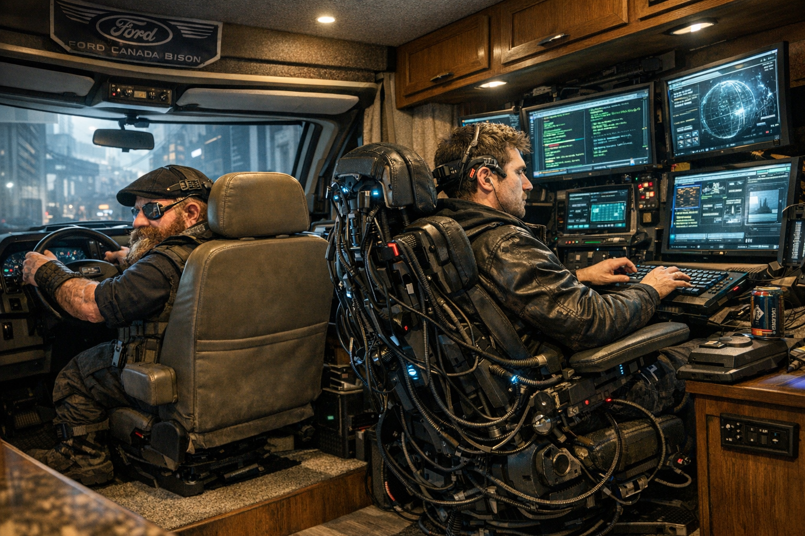

# Grandpa

## Overview

Curtis's **Ford-Canada Bison RV** / BusMod base and mobile command platform.

## Canon Stats

- **Handling:** 4/3
- **Speed/Acceleration:** 115/6
- **Body/Armor:** 4/4
- **Signature:** 3
- **Cargo:** 67/1918

## Installed Equipment

- **Morphing license plate:** linked to Grandpa's onboard computer; can reprogram plate color and embossed characters as a Complex Action. Cost paid by Curtis: **5,000¥**. Rules source: *Rigger 3 Revised*, p. 102-103.
- **Flood rescue / short-dunk package:** water seal, engine seal, **32 man-hours** of life support, and **20 emergency slap-patches**. Cost paid by Curtis: **10,800¥**. Installed by Curtis in **14 hours** using Car 4; final rolls were water seal 2 successes, engine seal 3 successes, life support 3 successes, and flood/dunk shakedown 3 successes. GM-approved on 2026-07-16. This lets Grandpa survive floodwater, toxic runoff, smoke/gas, and brief short-dunk immersion, but it is **not** a pressure-rated submarine conversion.

## Core Notes

- Controls and captain's chair are modified for a **2-foot dwarf operator**.
- Grandpa functions as Curtis's mobile rigger base and rolling support platform.
- Curtis operated from Grandpa during the March 18/19 operational sequence.
- Grandpa served as the platform from which the crew monitored surveillance feeds during the Jet Set Morgan tail.
- A satellite dish had previously been mounted on the RV for encrypted-contact monitoring.

## Matrix Retrofit / Luxury Mobile Connection

- Hardened deck bay / workstation
- Dual data access points
- Telecom uplink + ECCM package
- Conditioned / surge-protected power rail
- Segmented internal network with separate **rigger lane** and **deck lane**
- Hardened / shielded matrix nook
- Relay-node capable comms architecture
- Rapid reconfiguration electronics rack

## Operational Capability

- **Mevin** can perform mobile Matrix access/runs from inside Grandpa while **Curtis** drives or rigs.
- Supports hot-extraction posture with live connectivity.

## Relationships

- Linked to [Curtis](../PCs/Curtis.md) as primary operator.
- Linked to drone support, mobile overwatch, and live Matrix-enabled field operations.

## Relevant Sessions

- 2026-03-18 / 2026-03-19 — mobile operational base during Curtis-centered action.
- 2026-04-09 — used as the support node for Jet Set Morgan surveillance.

## Taco Fillings

> "Listen, Curtis, Grandpa ain't a battering ram unless you get stupid or desperate, and those two conditions love each other. This rig's for staying alive, staying linked, and getting your people out fast when the room turns mean. Keep your lanes clean, keep your power conditioned, and don't let some hotshot decker turn your home into a lightning strike."

## Sources

- `memory/2026-03-20.md`
- `memory/2026-04-09.md`
- `PARTY_DOSSIER.md`
