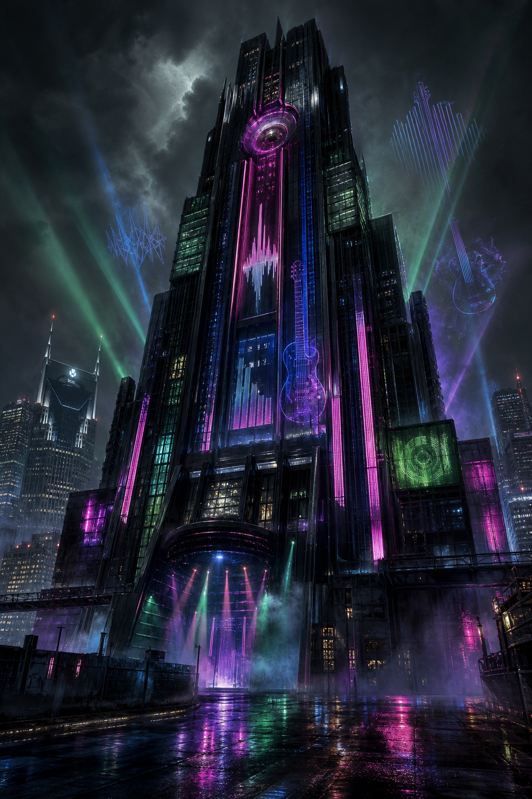

# Lafayette Tower

## Overview

**Lafayette Tower** is a downtown Nashville high-rise and the local headquarters for **[Cross Applied Technology](../Organizations/Cross-Applied-Technology.md)'s North American Entertainment Division**. It anchors the **[Music Circle](Music-Circle.md)** / **[Little Chiba](Little-Chiba.md)** area and is meant to evoke the same corporate-megastructure mood as the **Renraku Arcology**: sealed corporate verticality, internal culture, private infrastructure, and an unsettling sense that a whole world could exist inside one building.

Unlike the Renraku Arcology, Lafayette Tower is not known to be ruled by a rogue AI. The danger here is more corporate and creative: CAT built a deep entertainment R&D stack in the tower, including a basement **Ultraviolet host** used to brainstorm, prototype, and test new forms of entertainment.

## Address / Map

- **Address:** 1199-1153 Division St, Nashville, TN 37203
- **Map point:** `36.1509701, -86.7841524`
- **Confidence:** exact address range, mapped to the midpoint of available Division Street geocodes

## Public Face

From the street, Lafayette Tower reads as a polished entertainment-corporate landmark: glass, bright lobby surfaces, controlled access, and enough branding to make the building feel less like an office and more like a vertical media campus. Its lower public-facing layers are plausibly filled with reception space, studio-adjacent offices, meeting rooms, media suites, restaurants, and the sterile amenities that let corporate guests pretend they are not walking into a fortress.

The surrounding **Music Circle** area gives the tower a useful camouflage layer. Foot traffic, lunch crowds, service workers, performers, corp creatives, agents, and hangers-on all create enough movement that a quiet surveillance meet can happen in plain sight.

## Internal Character

Lafayette Tower's upper and internal floors are understood as CAT's entertainment machinery: talent analytics, licensing desks, media research, marketing psychology, focus-test environments, and whatever experimental production units CAT does not want attached to a more obvious lab facility.

The building's arcology-like feel comes from the implication that CAT can do a whole entertainment lifecycle inside the tower:

- scout and model an audience
- develop a pitch
- prototype immersive media
- run controlled feedback loops
- package the result for broadcast, simsense, music, or interactive release
- protect the whole process behind corporate security and Matrix isolation

## Basement Ultraviolet Host

The tower's most important known hidden feature is a basement **Ultraviolet host** used by CAT to brainstorm and prototype new entertainment forms.

Player-safe framing: this is not just a normal host with flashy UI. It is a controlled, high-end Matrix environment where metaphor, sensory design, and creative ideation can be made operational. CAT uses it as a conceptual forge: a place where executives, designers, media psychologists, and technical specialists can test entertainment ideas inside an environment more immersive and responsive than ordinary Matrix architecture.

Open questions remain around how safe that host is, what historical projects passed through it, and whether any of CAT's entertainment experiments intersect with the campaign's larger influence-engine themes.

## Known Facts

- Lafayette Tower is **Cross Applied Technology's North American Entertainment Division HQ**.
- It is deliberately reminiscent of the **Renraku Arcology** in mood and scale, but without a known rogue AI takeover.
- A basement **Ultraviolet host** exists beneath the tower and is used to brainstorm new forms of entertainment.
- Lafayette Tower is the mapped anchor for the **Music Circle / Little Chiba** area.
- The crew's **Griswell Data Services / Alvin Flang** surveillance work used this area as the surface meeting and follow point.
- The tail from this area eventually led toward the **[Music Circle Underground Market](Music-Circle-Underground-Market.md)**.

## Relationships

- [Cross Applied Technology](../Organizations/Cross-Applied-Technology.md) — corporate owner/operator of the entertainment division headquartered here.
- [Music Circle](Music-Circle.md) — public/surface meeting and surveillance zone around the tower.
- [Little Chiba](Little-Chiba.md) — associated district/location layer around the tower.
- [Music Circle Underground Market](Music-Circle-Underground-Market.md) — underground route/context reached from the wider area.
- [Griswell Data Services](../Organizations/Griswell-Data-Services.md) — linked indirectly through the surveillance run staged around Music Circle.

## Relevant Sessions

- 2026-06-04 — Music Circle first surfaced as Alvin's park-side handoff zone.
- 2026-07-02 — the follow from the area exposed Palermo's underground operating location.

## Open Questions

- What projects has CAT run through the basement Ultraviolet host?
- Did the host contribute to any current Nashville entertainment or influence-engine technologies?
- How physically isolated is the host from the rest of the tower?
- Who has legitimate access to the host, and who has backdoor or legacy access?
- Is Lafayette Tower merely a corporate entertainment HQ, or one of the quiet roots of the campaign's media-manipulation web?

## Sources

- [Session 2026-06-04](../Sessions/2026-06-04.md)
- [Session 2026-07-02](../Sessions/2026-07-02.md)
- User-provided map/address/corporate canon on 2026-07-03
