# Mucky's Place

## Overview

**Mucky's Place** is a ShadowRunner club frequented by Nashville's criminal elite looking to do business, high rollers seeking hot streaks, crooked politicians making deals, and rubes with more money than brains. It is lively, and people can relax there knowing no one wants to start trouble with **Mucky's** security on patrol. People enjoy themselves at Mucky's Place; some would say even to a suspicious degree.

There are shows, games, and private rooms for conducting business. Mucky is there most every night unless unavoidably detained. Always a wolf with a flair for the theatric, he revels in the attention and the hedonism. Being almost completely self-interested, it brings him great joy to build leverage and rake in cash.

## Gallery

  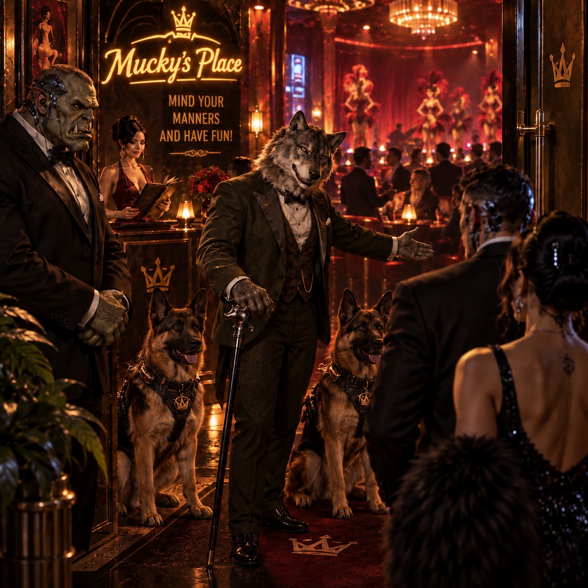
  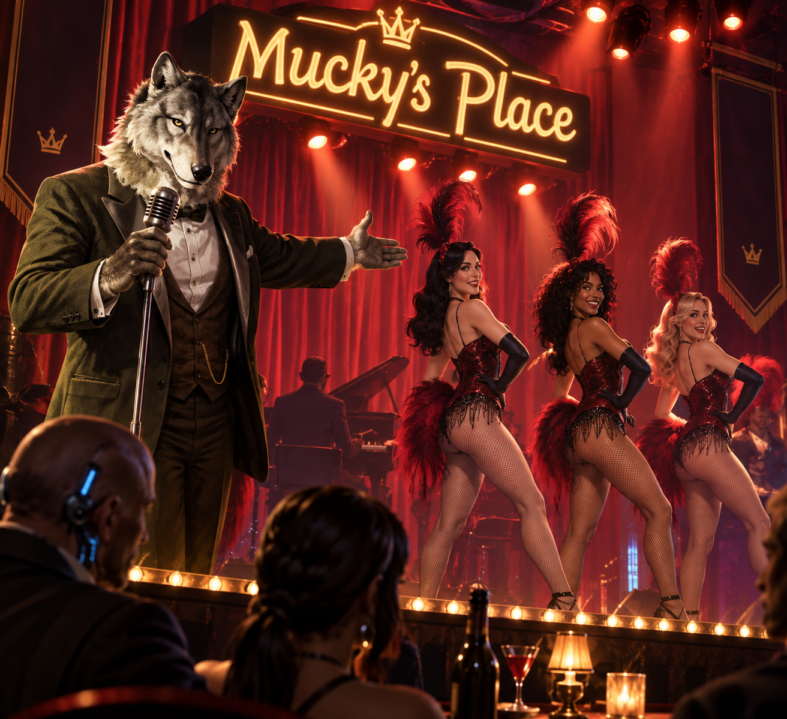
  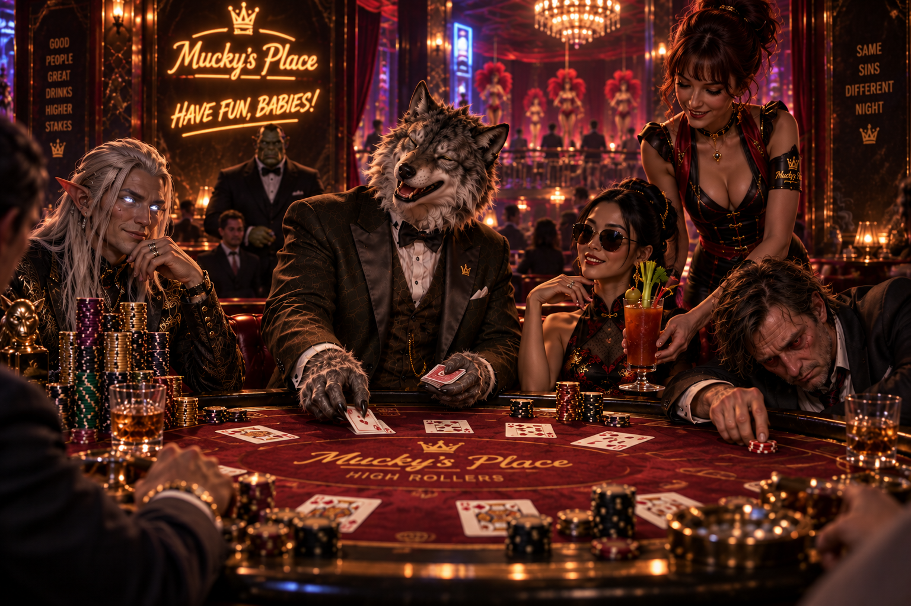
  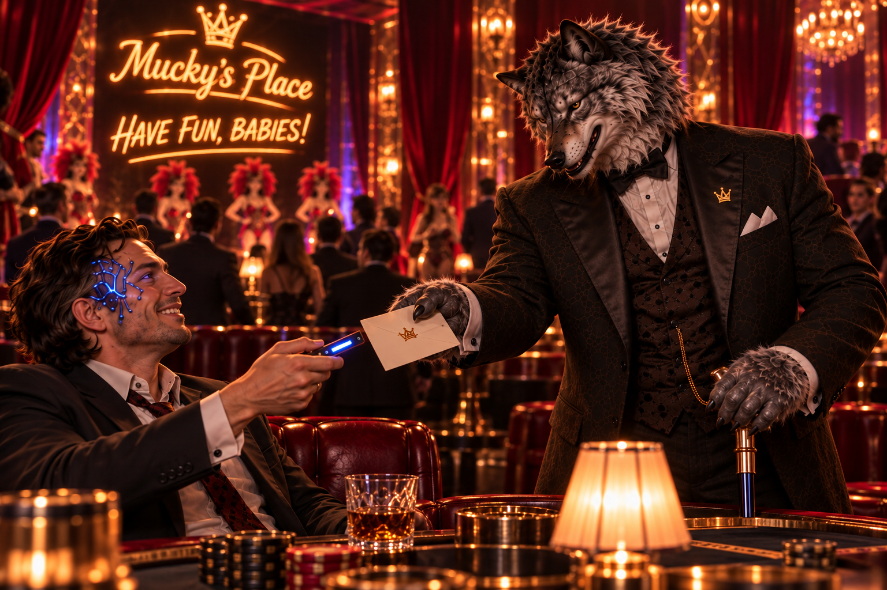
  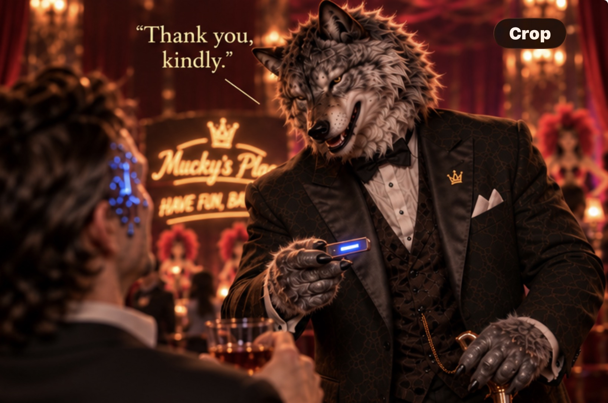
  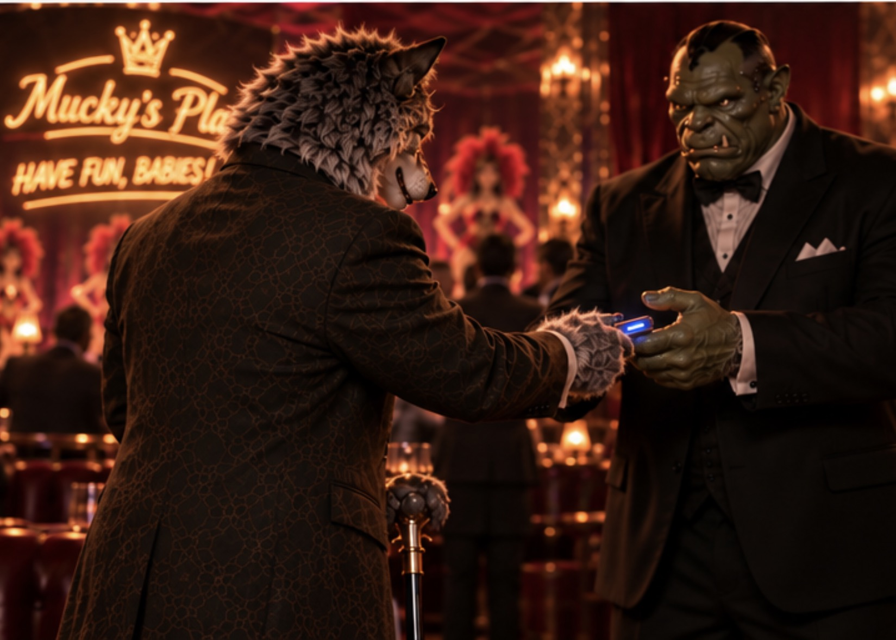
  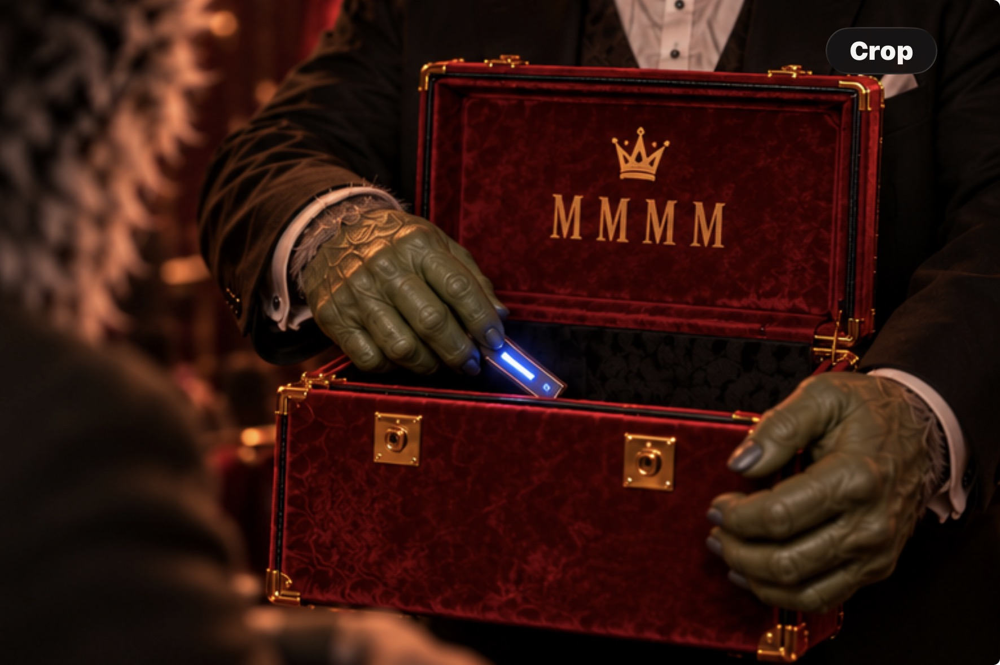
  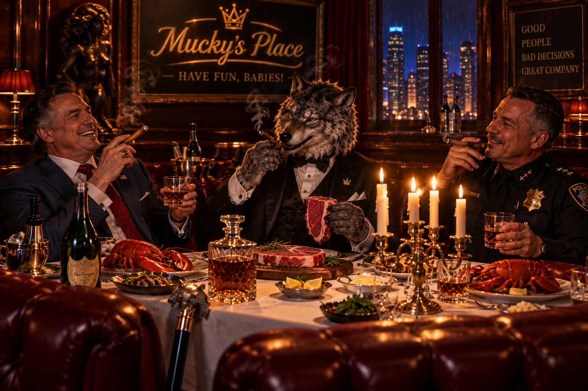
  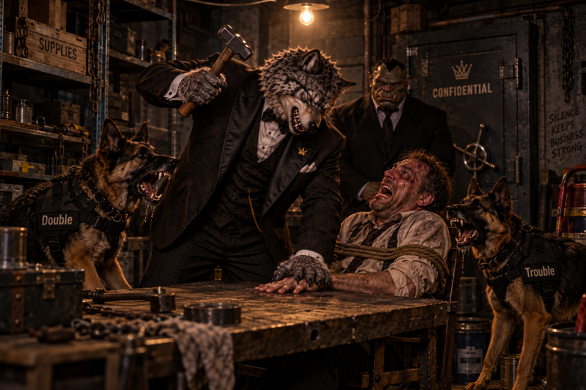
  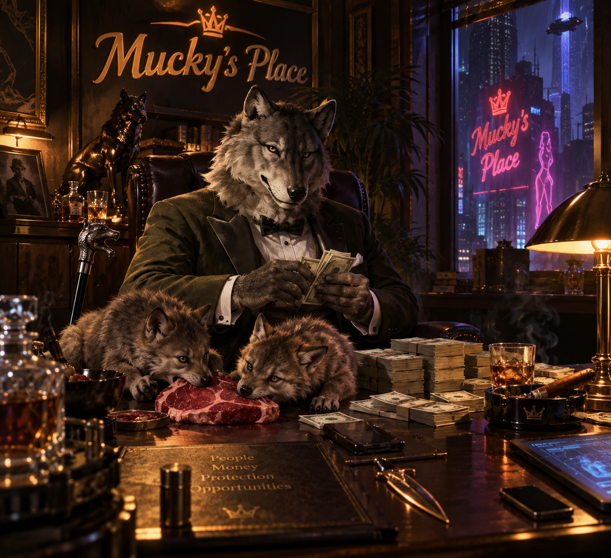
  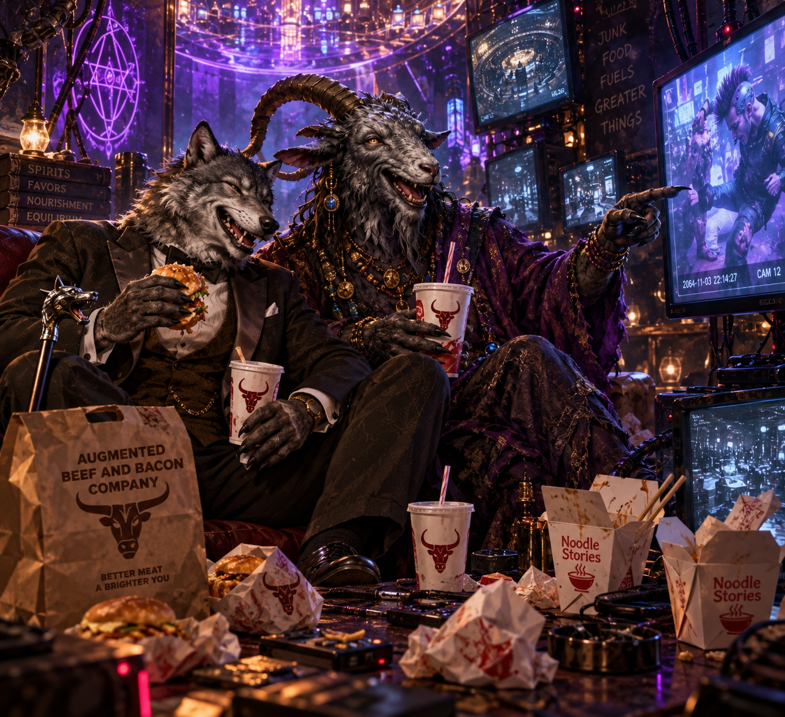

## Known Facts

- The site is a Mucky-owned ShadowRunner club in Nashville with shows, games, and private rooms for conducting business.
- It is frequented by Nashville's criminal elite, high rollers, crooked politicians, and careless marks.
- Mucky's security keeps the peace, making the club feel safe enough for patrons to relax and enjoy themselves.
- **Melchizedek**, a Force 9 Great Form Free Hearth Spirit, treats the site as his Personal Domain under the house compact with Mucky.
- The crew chose it as the next destination in Session 2026-09-03 after luring Belisarius away from his usual 8th Street alley dice game.

## Relationships

- Owned by [Memphis Menthol Mephistopheles Muckmeyer](../NPCs/Mucky.md).
- Domain of [Melchizedek](../NPCs/Melchizedek.md).
- Governed by [The House Compact of Melchizedek and Mucky](../NPCs/Melchizedek-Mucky-House-Compact.md).
- Current destination in the [Byron Cedar / Judge Belisarius Rush Job](../Arcs/Byron-Cedar-Judge-Belisarius-Rush-Job.md).

## Relevant Sessions

- **2026-09-03** - chosen as the current lure destination for Judge Belisarius and Renaud Dupree.

## Open Questions

- What does Mucky consider acceptable business in the parking lot or approach?
- How does Melchizedek react to a rigged con involving a corrupt judge and a cybered troll bodyguard?

## Sources

- [Session 2026-09-03](../Sessions/2026-09-03.md)
- [Melchizedek](../NPCs/Melchizedek.md)
- [The House Compact of Melchizedek and Mucky](../NPCs/Melchizedek-Mucky-House-Compact.md)
- Discord image attachments, 2026-09-04
