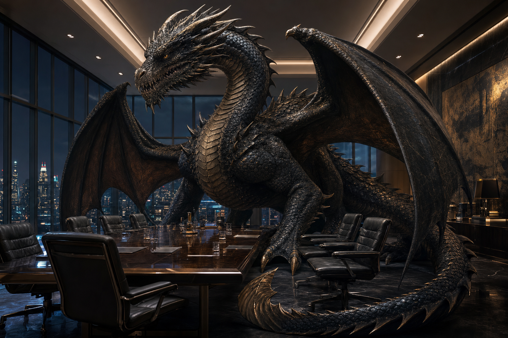

# Claude August

_Claude August's false human form._

_Claude's true form._

## Overview

**Claude August** is the young CEO and controlling owner of **[The Princeps Group](../Factions/The-Princeps-Group.md)**, a Huntsville-based CAS miltech corporation. He appears to be a teenage human, but the players know he is secretly a **juvenile western dragon**.

## Known Facts

- Claude appears to be a young man, seemingly still in his teens.
- He emerged as Princeps's new owner after the previous leadership became embroiled in a financial scandal.
- He executed a government-backed stock takeover that placed him in control of the corporation.
- He now serves as CEO of Princeps.
- The players know Claude is secretly a juvenile western dragon.
- Claude keeps his draconic nature hidden because the CAS may not recognize him as a citizen if exposed.
- If the CAS does not recognize Claude's citizenship, his legal ownership of Princeps could be challenged or voided.

## Role in the Campaign

- Corporate principal behind a protected CAS miltech research company.
- Legal and political pressure point where corporate ownership, national security, and dragon identity collide.
- A living reason Princeps's independence is fragile: the same secret that makes Claude extraordinary could imperil his ownership.

## Relationships

- **[The Princeps Group](../Factions/The-Princeps-Group.md):** CEO and controlling owner.
- **[Confederated American States](../Locations/Confederated-American-States.md):** His takeover was government-backed, but his legal standing may depend on remaining publicly human.
- **Former Princeps leadership:** Replaced after the financial scandal that opened the takeover path.
- **CAS military:** Indirectly tied through Princeps's military research and procurement relationships.

## Capabilities / Resources

- Control of an independent single-A miltech research corporation.
- Political backing from CAS interests that want Princeps to remain a domestic counterweight to megacorp influence.
- Draconic intellect, physical reality, and long-term agenda potential, limited by the need to pass through human legal systems.

## Vulnerabilities

- Public exposure as a dragon could trigger a citizenship and ownership challenge.
- Princeps's independence depends on CAS political protection, which may become conditional if Claude's nature becomes inconvenient.
- Rivals could attack him through corporate law rather than direct violence.

## Relevant Sessions

- [2064-03-01](../Sessions/2064-03-01.md) - archived notes reference Princeps ownership and a dragon-level power struggle around Lord August.

## Related Pages

- [The Princeps Group](../Factions/The-Princeps-Group.md)
- [Huntsville](../Locations/Huntsville.md)
- [Confederated American States](../Locations/Confederated-American-States.md)
- [Late January Headlines](../Clues/Late-January-Headlines.md)

## Open Questions

- Who backed Claude inside the CAS government, and why?
- Did Claude engineer the scandal, exploit it, or inherit an opening created by someone else?
- Which corporate rivals know or suspect his true nature?
- What legal theory keeps Claude's ownership intact if his dragon identity becomes impossible to deny?

## Sources

- Discord request, 2026-07-08.
- Discord image attachment, 2026-07-08.
- [Session 2064-03-01](../Sessions/2064-03-01.md).
