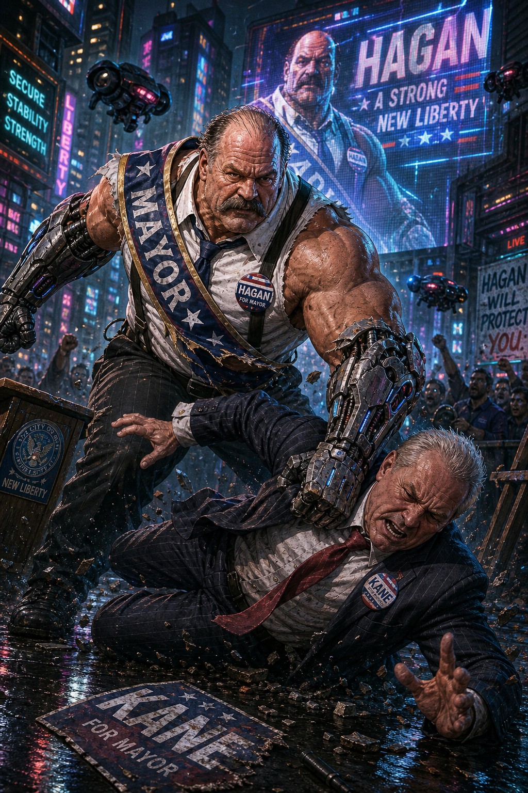

# Mayor Mike Haggar - Cyber-Samurai Backup Model

> **Backup alternate only:** The canonical Mayor Mike Haggar entry is now the bred drake physical adept model at [Mayor Mike Haggar](../Mayor-Mike-Haggar.md). This cyber-samurai build is retained as a non-canon fallback if the table ever needs the older chrome-heavy interpretation.

## Overview

Current mission principal for the Nashville Shadowrun campaign. Older consolidated campaign material spells the same figure as **Mayor Hagar**; this appears to be the same entity.

## Known Facts

- The party dossier lists Mayor Mike Haggar as the current mission principal.
- The overarching campaign mission state as of the early 2026 notes is "Helping Mayor Mike Haggar."
- Older campaign material shows the mayor already mattered during the post-federal-exit unrest, including curfew and civic-order concerns.
- Older logs also show shrine/folk-myth behavior forming around the mayor, suggesting he had symbolic weight in parts of Nashville beyond formal politics.
- In the 2066-05-09 Righteous Haze interlude, Haggar directly hired **Kurgan** and **Curtis** through **Joseph Neumann** to remove a failed outside fixer/security consultant.
- That same session included a table correction: visible chrome/cyberware on Haggar should **not** be treated as confirmed canon until the GM rebuilds the page/stat block.

## Relationships

- Connected to the crew as a mission-driving principal.
- Indirectly tied to the insect-spirit and city-power arc that preceded the current Darla/influence-network investigation.

## Relevant Sessions

- 2023-03-23 — older consolidated references under spelling variant "Hagar".
- 2026-02-27 — current mission principal confirmed in roster update.

## SR3 NPC build: retired high-end street samurai / political leader

> **Revision note:** Session 2026-06-25 walked back Haggar's visible cyberware as confirmed canon. The older stat block below is retained as a provisional table aid, but its cyberware assumptions need GM review before use.

### Build assumptions

- **System:** *Shadowrun, Third Edition*
- **Metatype:** Human
- **Magic:** none / mundane
- **Role at the table:** powerful mission principal, civic power broker, and dangerous ex-runner whose physical threat is still real but usually secondary to his office, security detail, and public legitimacy.
- **Power level:** prime-runner NPC. Haggar should feel like someone who survived elite street-level violence long enough to turn that reputation into a political machine.

These numbers are meant for scenes where the players negotiate with him, test his patience, try to read him, protect him, betray him, or discover that the old man can still put somebody through a wall. He is not built as a fresh starting PC.

### Attributes

- **Body:** 6 (8 for damage-resistance tests when dermal/bone reinforcement applies)
- **Quickness:** 6
- **Strength:** 7
- **Charisma:** 6
- **Intelligence:** 5
- **Willpower:** 7
- **Essence:** about 0.5 to 1.0, depending on final cyberware grade and option loadout
- **Reaction:** 11
- **Initiative:** 11 + 3D6
- **Magic:** 0
- **Combat Pool:** 9
- **Karma Pool:** 5
- **Professional Rating:** 6

### Active Skills

- **Unarmed Combat:** 9
  - Suggested specialization: **Grappling / Subdual:** 11
- **Athletics:** 7
- **Pistols:** 7
  - Suggested specialization: **Smartlinked Heavy Pistols:** 9
- **Submachine Guns:** 6
- **Edged Weapons:** 5
- **Thrown Weapons:** 4
- **Stealth:** 5
- **Car:** 4
- **Biotech:** 4
- **Etiquette:** 7
  - Suggested specialization: **Politics:** 9
- **Leadership:** 8
- **Negotiation:** 7
- **Intimidation:** 8
- **Interrogation:** 5
- **Computer:** 3
- **Electronics:** 3

### Knowledge Skills

- **Nashville Politics:** 8
- **Nashville Shadow Community:** 7
- **Urban Security Procedures:** 7
- **Law Enforcement Politics:** 6
- **Corporate Public-Private Partnerships:** 6
- **Organized Crime:** 5
- **Runner Tactics:** 6
- **Media Optics:** 6
- **Municipal Law:** 5
- **Civic Infrastructure:** 5
- **Old War Stories:** 5

### Language Skills

- **English:** 6
- **Spanish:** 3
- **Japanese:** 2

### Cyberware / bioware profile

Use alpha-grade cyberware where needed to keep the package legal and to reflect expensive post-career medical maintenance. The exact Essence total can be tuned by the GM, but the intended final range is low-Essence mundane rather than cyberzombie territory.

- **Wired Reflexes 2** — the old street-sam backbone; explains the 3D6 initiative.
- **Reaction Enhancers 2** — keeps him frighteningly fast even by veteran-runner standards.
- **Smartlink-2** — usually hidden behind a dignified public image, but still live.
- **Cybereyes** with flare compensation, low-light, display link, and image link.
- **Cyberears** with sound filter and select sound filter / dampener package.
- **Datajack** and secure internal communications package.
- **Dermal reinforcement** such as dermal plating or dermal sheathing, enough to justify the reinforced Body value above.
- **Bone lacing or comparable skeletal reinforcement** for survivability and brutal close-quarters staging.
- **Bioware muscle support** such as muscle augmentation / toner may explain his still-impressive Strength and Quickness without requiring additional Essence.

### Typical gear and public-facing assets

- **Public appearance:** armored executive clothing or concealed lined coat equivalent; visible weapons avoided unless the scene is already in crisis.
- **Alert appearance:** armor jacket or security armor appropriate to the venue, smartlinked heavy pistol, spare magazines, nonlethal ammunition, trauma patches, encrypted comms, and bodyguard net access.
- **Political assets:** mayoral staff, legal counsel, press operation, city security access, friendly law-enforcement channels, emergency-response visibility, and a deep bench of people who owe him favors.
- **Shadow assets:** old runner contacts, quiet street-level loyalty, muscle who remember the legend, enough deniable intermediaries to act without making City Hall fingerprints obvious, and a rebuilt outside-security apparatus now potentially involving **Kurgan**.

### Common table-use rolls

- **Reading the room / spotting a setup:** Intelligence 5, often backed by Nashville Politics 8, Runner Tactics 6, or Urban Security Procedures 7.
- **Negotiating a deal:** Negotiation 7, with Etiquette (Politics) 9 when the scene is formal or civic.
- **Commanding a room:** Leadership 8; use Charisma 6 as the backing attribute for social pressure.
- **Threatening without sounding like a thug:** Intimidation 8. His best threats are calm, legalistic, and specific.
- **Resisting intimidation or manipulation:** Willpower 7, plus relevant social skill if the situation is an opposed social exchange.
- **Physical confrontation:** Reaction 11 + 3D6, Combat Pool 9, Unarmed Combat 9 / Grappling 11. He should almost always try to end a melee by controlling, pinning, or throwing the opponent rather than trading flashy blows.
- **Firefight:** Pistols 7 / Smartlinked Heavy Pistols 9, Combat Pool 9. He is efficient, conservative, and protective of bystanders because every shot has political consequences.

### How to play him mechanically

- **Do not make him reckless.** Haggar survived by knowing when violence was useful and when it was a trap.
- **Let social position matter.** In a normal meeting, players are not only rolling against his skills; they are also dealing with cameras, aides, police channels, public optics, and the risk of making an enemy of City Hall.
- **Let the old samurai show through under stress.** If negotiations collapse or an assassination attempt starts, his first few seconds should remind the table that "retired" does not mean "soft."
- **Keep his morality practical.** He can be sincere about protecting Nashville and still be ruthless, transactional, and used to making ugly calls.
- **Use his reputation as armor.** Street NPCs may hesitate to cross him because they remember the body count before they remember the speeches.

### Quick NPC summary

Mayor Mike Haggar is a **high-level mundane human street samurai who successfully laundered combat credibility into civic authority**. Against runners, his most important numbers are not just Pistols 7 or Unarmed Combat 9; they are **Leadership 8, Etiquette (Politics) 9, Negotiation 7, Intimidation 8, Willpower 7, Reaction 11 + 3D6, and Combat Pool 9**. He can still fight, but his real danger is that he can decide whether the fight happens in an alley, a council hearing, a police briefing, or a front-page scandal.

## Open Questions

- What is Haggar's current degree of awareness of the deeper threats the crew is facing?
- How directly is he still tied into the crew's active operational agenda?
- How should Haggar's prior cyberware-heavy stat block be revised after the 2026-06-25 table correction?

## Sources

- `memory/2026-02-27.md`
- `PARTY_DOSSIER.md`
- `/Volumes/carbonite/claw/data/cindylou/cleaned/memory/10_consolidated/campaign/entities/mayor-hagar.md`
- *Shadowrun, Third Edition*
- *Man & Machine*
- [Session 2026-06-25](../../Sessions/2026-06-25.md)
