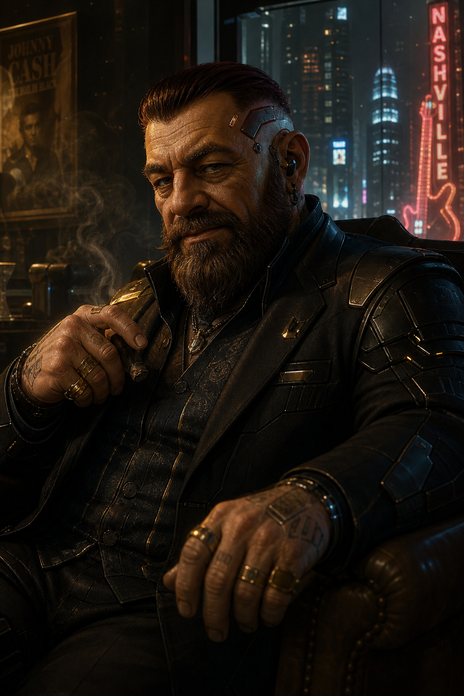

# Ivan Toklas

## Overview

**Ivan Toklas** is a recurring dwarf fixer / broker who repeatedly serves as the crew's front-end contact for jobs, introductions, and sensitive meetings. He is strongly associated with [Atlas's](../Locations/Atlass.md), where he appears to maintain a small upstairs room, and he routinely sits at the point where employers, specialists, and the crew first connect.

## Known Facts

- Ivan Toklas is a **dwarf**.
- He functions as a **job broker / intermediary** rather than a field operator in the material currently surfaced.
- He repeatedly brings the crew into runs through direct briefings, introductions, or referral chains.
- He is tied closely to [Atlas's](../Locations/Atlass.md), which includes a small room used by him.
- In the Darla / [SC Music](../Factions/SC-Music.md) arc, the team explicitly understands the contract path as running through Ivan.
- He also appears in the setup layer around the [Floyd Otis](Floyd-Otis.md) security job and the Efficient Solutions / morgue / datastone chaos of 2064-08-02.
- He is comfortable moving between very different job ecosystems: corporate music politics, magical-danger recovery, high-society security, extraction work, politically messy storefront security, and deeply strange black-ops / Arcology fallout.

## Operational Pattern

Across the newly added session history, Ivan consistently appears as the person who:

- calls the crew into the room,
- frames the job at a business or logistics level,
- introduces other principals or specialists,
- and then hands the run off to the team once the contract web is established.

That makes him look less like a one-off Johnson and more like a **stable Nashville-area broker node** with broad reach.

## Relationships

- [Atlas's](../Locations/Atlass.md) — strongly linked; Ivan appears to operate out of a small private room there.
- [SC Music](../Factions/SC-Music.md) — tied to the Darla master-recordings job route.
- [Darla Ledue](Darla-Ledue.md) — Ivan sits on the contract chain leading into the Darla / stolen-masters investigation.
- [Kari Wilkerson](Kari-Wilkerson.md) — Ivan brought the crew into Kari's Draco Foundation briefing.
- [Merle Graham](Merle-Graham.md) — both appear in the older Drexler / Zoil-era web.
- Fiona Jones — Ivan and Atlas bring the team into the Fiona disappearance case.
- Cambien — Ivan brings Cambien into the Hank IT / festival-security problem.
- [Floyd Otis](Floyd-Otis.md) — Ivan is part of the brokerage path into the Otis souvenir-store security job.
- Atlas — repeatedly paired with Ivan in job setup scenes, though Atlas does not yet have a dedicated wiki page.

## Relevant Sessions

- **2023-05-11** — Ivan brings the crew into a priority meeting at [Atlas's](../Locations/Atlass.md), leading to [Kari Wilkerson](Kari-Wilkerson.md)'s toxic-biomaterial job.
- **2061-11-14** — Ivan briefs the team on a Big Race / Zoil / Drexler-linked early-era job bundle involving [Merle Graham](Merle-Graham.md) and Atlas.
- **2062-01-20** — Ivan brings in Cambien and steers the crew toward Hank IT, festival security, and ghoul-linked trouble.
- **2062-05-05** — Ivan offers a luxury casino / ship security job with heavy surveillance and anti-cheating concerns.
- **2062-06-01** — Ivan and Atlas pull the team into a Renraku Arcology / G.O.D. investigation with AI-tainted implications.
- **2064-03-08** — Ivan assembles the crew around Mistice and Fong for a trapped-scientist extraction involving cult / chrome / corporate crossover.
- **2064-08-02** — Ivan appears within the Efficient Solutions / morgue / datastone tangle, suggesting he remains in the crew's wider operating orbit even outside cleaner briefing scenes.
- **2065-03-04** — Ivan and Atlas bring the team into the Fiona Jones disappearance / Bingham 4 case.
- **2065-03-21** — a Johnson job around [Floyd Otis](Floyd-Otis.md)'s store is explicitly brokered through Ivan.
- **2026-04-02** — Ivan remains the front-end route into the [SC Music](../Factions/SC-Music.md) / [Darla Ledue](Darla-Ledue.md) stolen-master-recordings arc.

## Synthesis

The newer session imports broaden Ivan substantially. He is no longer just "the guy who routed the Darla job." He now reads as a **recurring campaign connective tissue character** who links:

- Nashville shadowrunner hiring space,
- [Atlas's](../Locations/Atlass.md) as a neutral meeting ground,
- corporate / entertainment work,
- outside specialists and patrons,
- layered security and extraction jobs,
- and several major investigation / weirdness arcs.

He appears to occupy a trusted middle layer between employers and runners: visible enough to brief the team directly, but still one step removed from the deepest hidden agenda on most jobs.

## Open Questions

- How much of Ivan's network is local Nashville infrastructure versus broader regional shadow-broker reach?
- Does he simply rent/hold space at [Atlas's](../Locations/Atlass.md), or is he one of the location's key internal power brokers?
- How much does he know in advance about the deeper weirdness on the jobs he routes: Arcology fallout, toxic biomaterial, cult/chrome operations, or media/corporate manipulation?
- Is Ivan primarily loyal to his clients, to the runner community around Atlas's, or to his own long-game brokerage position?

## SR3 statted NPC build (player-character style)

### Build assumptions

- **System:** *Shadowrun, Third Edition*
- **Metatype:** Dwarf
- **Magic:** none / mundane
- **Character creation method:** Priority system
- **Priority spread:** **A Resources, B Skills, C Attributes, D Metatype, E Magic**
- **Concept target:** socially dominant broker / fixer who survives by charm, reputation, information control, and a modest but professional amount of chrome.

### Starting SR3 chargen build

#### Attributes (natural)

- **Body:** 4
- **Quickness:** 5
- **Strength:** 4
- **Charisma:** 6
- **Intelligence:** 6
- **Willpower:** 3
- **Essence:** 3.35
- **Reaction:** 5 (6 augmented)
- **Magic:** 0

> Dwarf racial modifiers applied from SR3 core: +1 Body, +2 Strength, +1 Willpower.

#### Active Skills at chargen

- **Car:** 4
- **Computer:** 3
- **Electronics:** 3
- **Etiquette:** 6
- **Intimidation:** 5
- **Leadership:** 6
- **Negotiation:** 6
- **Pistols:** 4
- **Stealth:** 3

#### Knowledge Skills (30 points)

- **Nashville Shadow Economy:** 6
- **Corporate Politics:** 5
- **Entertainment Business:** 5
- **Smuggling Routes:** 4
- **Law Enforcement Procedures:** 4
- **Media Personalities:** 3
- **Street Rumors:** 3

#### Language Skills (9 points)

- **English:** 5
- **Japanese:** 2
- **Spanish:** 2

#### Cyberware package at chargen

- **Datajack** — Essence 0.2, Cost 1,000¥
- **Chipjack** — Essence 0.2, Cost 1,000¥
- **Knowsoft Link** — Essence 0.1, Cost 1,000¥
- **Headware Memory 150 Mp** — Essence 0.5, Cost 22,500¥
- **Internal Telephone** — Essence 0.75, Cost 3,700¥
- **Subvocal Microphone** — Essence 0.1, Cost 850¥
- **Voice Modulator** — Essence 0.5, Cost 45,000¥
  - **Playback option** — Cost 40,000¥
  - **Tonal Shift option** — Cost 25,000¥
- **Reaction Enhancer 1** — Essence 0.3, Cost 60,000¥

**Chargen cyberware total:** **200,050¥**

#### Standard baseline gear at chargen

- **Ares Predator III** with spare magazines and mixed regular / gel ammunition
- **Armor Jacket** and conservative executive outerwear
- multiple **fake SIN / credstick / business identity** packages
- curated **knowsoft and datasoft library** focused on law, music business, etiquette, local politics, and market chatter
- high-end wardrobe, jewelry, and hospitality budget appropriate to a visible middle-tier fixer

### 120 Karma advancement

Ivan's long-term advancement spends **exactly 120 Karma** on Attributes and Skills.

#### Attribute advancement (30 Karma)

- **Willpower 3 -> 4** = 8 Karma
- **Willpower 4 -> 5** = 10 Karma
- **Quickness 5 -> 6** = 12 Karma

#### Skill advancement (90 Karma)

- **Etiquette 6 -> 7** = 14 Karma
- **Negotiation 6 -> 7** = 14 Karma
- **Leadership 6 -> 7** = 14 Karma
- **Intimidation 5 -> 6** = 9 Karma
- **Interrogation 0 -> 1** = 1 Karma
- **Interrogation 1 -> 2** = 3 Karma
- **Interrogation 2 -> 3** = 4 Karma
- **Interrogation 3 -> 4** = 6 Karma
- **Computer 3 -> 4** = 6 Karma
- **Electronics 3 -> 4** = 6 Karma
- **Pistols 4 -> 5** = 7 Karma
- **Stealth 3 -> 4** = 6 Karma

**Total Karma spent:** **120**

### Post-karma final stat line

#### Attributes (natural / final)

- **Body:** 4
- **Quickness:** 6
- **Strength:** 4
- **Charisma:** 6
- **Intelligence:** 6
- **Willpower:** 5
- **Essence:** 3.35
- **Reaction:** 6 (7 augmented)
- **Initiative:** 7 + 1D6
- **Magic:** 0
- **Combat Pool:** 8

#### Final Active Skills

- **Car:** 4
- **Computer:** 4
- **Electronics:** 4
- **Etiquette:** 7
- **Intimidation:** 6
- **Interrogation:** 4
- **Leadership:** 7
- **Negotiation:** 7
- **Pistols:** 5
- **Stealth:** 4

### Additional 500,000¥ post-career gear spend

The following gear package spends **exactly 500,000¥** and leans hard into Ivan's role as an information broker, coordinator, and logistics node.

#### Vehicles

- **GMC Bulldog Sec. Step-Van** — 52,600¥
- **Ford Americar** — 20,000¥

#### Electronics / operations infrastructure

- **Electronics / computer / cyberware facility** — 300,000¥
- **Table-top personal computer, 1,000 Mp memory** — 100,000¥
- **Pocket Secretary** — 2,000¥
- **4 Rating 6 micro-transceivers** — 24,000¥
- **14 wrist-model cellphones** — 1,400¥

**Additional gear total:** **500,000¥**

### Final NPC interpretation

Built straight as an SR3 mundane dwarf PC, Ivan Toklas comes out as a **high-Charisma professional fixer** rather than a combat monster or matrix specialist. He has:

- enough **chrome** to feel meaningfully cybered without turning into a street samurai,
- enough **social skill depth** to sell jobs, control rooms, and push reluctant people into motion,
- enough **technical competence** to manage secure communications and operational infrastructure,
- and enough **gear capital** to function as a real broker with vehicles, burners, workshop-grade electronics support, and a mobile logistics platform.

That fits the version of Ivan surfaced by the campaign notes: a recurring dwarf intermediary who sits between runners, clients, venues, and problem sets, and who keeps showing up at the front end of complicated jobs.

## Sources

- [Session 2023-05-11](../Sessions/2023-05-11.md)
- [Session 2061-11-14](../Sessions/2061-11-14.md)
- [Session 2062-01-20](../Sessions/2062-01-20.md)
- [Session 2062-05-05](../Sessions/2062-05-05.md)
- [Session 2062-06-01](../Sessions/2062-06-01.md)
- [Session 2064-03-08](../Sessions/2064-03-08.md)
- [Session 2064-08-02](../Sessions/2064-08-02.md)
- [Session 2065-03-04](../Sessions/2065-03-04.md)
- [Session 2065-03-21](../Sessions/2065-03-21.md)
- [Session 2026-04-02](../Sessions/2026-04-02.md)
- *Shadowrun, Third Edition*
- *Man & Machine*
- *Rigger 3 Revised*
