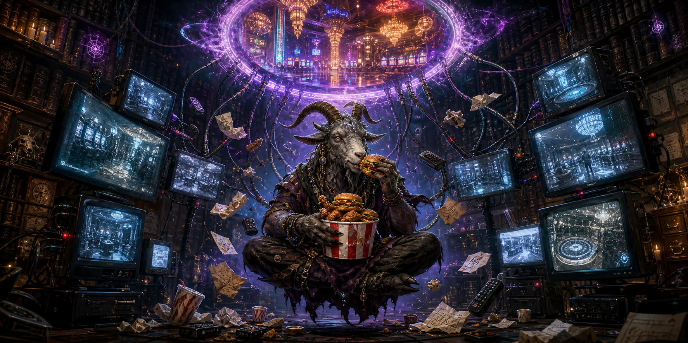

# Melchizedek

## Overview

Melchizedek is a magical NPC: a **Great Form Free Hearth Spirit**, built from the SR3 free spirit rules in *Magic in the Shadows*. He is Force 9 with Spirit Energy 4, and manifests to metahumans as a small goat-headed humanoid that hovers with unmistakably mystical poise. His current Personal Domain is a Nashville gambling hall/hotel owned by **Mucky**. He is obsessed with metahuman excess, especially trid content, Matrix feeds, and bad fast food.

## Known Facts

- Melchizedek is a **free spirit** and therefore an independent NPC with free will.
- Spirit classification: **Great Form Free Hearth Spirit**.
- Spirit category: **Nature spirit**, specifically a **Spirit of Man** subtype.
- Force: **9**.
- Spirit Energy: **4**.
- Free spirit powers beyond his base spirit type: **Personal Domain**, **Wealth**, **Sorcery**, and **Astral Gateway**.
- When interacting with metahumans, he takes the form of a goat-headed humanoid about 4 feet high and tends to hover in a mystical fashion; this is treated as his materialized spirit appearance rather than the Human Form power.
- Personal Domain: a gambling hall/hotel in Nashville owned by **Mucky**; the site is smaller than Melchizedek's maximum possible Personal Domain area, so the unused potential area is simply wasted.
- He is obsessed with knowledge of metahuman excess, especially trid content, Matrix feeds, and bad fast food.
- He trades magical wealth for access to television, feeds, junk food, and similar indulgences.
- If denied access or interrupted while consuming his favored media/food, he may react violently and use his powers to compel people to provide what he wants.
- True name, exact domain boundaries, chain of obligations, and relationship to the crew are **not yet established**.

## SR3 Rules Snapshot

- *Magic in the Shadows* identifies free spirits as non-player characters with free will and gives them Force, Good Karma, Spirit Energy, and additional free spirit powers.
- A Spirit of Man can be narrowed to **city**, **hearth**, or **field** spirit; Melchizedek is the **hearth** choice.
- The free spirit generation rules allow a spirit to be a **great form** version after determining spirit type.
- Spirit Energy augments Force-based powers, boosts physical forms, adds to astral Initiative, and can be burned in desperate situations.
- For designed NPCs, the GM may choose ratings and powers directly instead of rolling randomly.

## Role in the Campaign

- Occult consumer of metahuman excess whose bargains can be absurdly generous but dangerously imbalanced.
- Potential patron, threat, informant, or local godling attached to Mucky's gambling hall/hotel.
- His library/viewing-dome obsession makes him a possible source of strange intelligence about observed metahuman behavior, broadcasts, feeds, and indulgence patterns.

## Relationships

- Linked to **Mucky** through his current Personal Domain: a Mucky-owned gambling hall/hotel in Nashville.

## Capabilities / Resources

- Force 9 great-form spirit-level magical presence.
- Spirit Energy 4.
- Base hearth spirit powers: **Accident**, **Concealment**, **Confusion**, **Guard**, **Materialization**, and **Search**.
- Great form Spirit of Man benefit: **Divination** for questions related to his domain.
- Free spirit powers: **Personal Domain**, **Wealth**, **Sorcery**, and **Astral Gateway**.
- Sorcery Skill 4, with Spell Pool 9.
- Known spells: **Stunbolt 4**, **Powerball 4**, and **Catalog 4**.
- Melchizedek may know additional spells at GM discretion, especially if they fit his long-running obsession with observation, consumption, records, and control of his domain.
- Personal Domain: a Mucky-owned gambling hall/hotel in Nashville. The site is smaller than the Force 9 maximum area for the Personal Domain power, leaving the extra potential area unused.
- Hearth-domain theming suggests influence around homes, shelters, family spaces, hospitality, domestic safety, private rooms, hotels, or places treated as a dwelling.
- He has carved out a persistent library-like space associated with his native metaplane, connected to a viewing dome where he observes and records non-astral being behavior.
- Exact domain boundaries and relationship web remain unresolved.

## Open Build Choices

- Define the exact name, layout, and physical boundaries of the Mucky-owned gambling hall/hotel that serves as Melchizedek's **Personal Domain**.
- Define his public face: comforting hearth guardian, ancient household god, predatory domestic spirit, occult fixer, bound servant, or another role.
- Decide whether his compulsive consumption is comic, horrifying, transactional, addictive, or all of those at once.
- Decide who currently feeds his appetite for trid, Matrix feeds, and fast food, and what happens when the supply is interrupted.
- Decide whether he has additional spells beyond the three currently listed.

## Canon Notes

- Under SR3, **Personal Domain** is a listed free spirit power. The spirit chooses a fixed domain appropriate to its nature; inside that domain, its Spirit Energy doubles for powers and physical attributes affected by Spirit Energy. For a Force 9 spirit, the maximum domain area is 90,000 square meters.
- Melchizedek's goat-headed, hovering humanoid form is treated as his materialized spirit appearance. This avoids needing the **Human Form** free spirit power, which is more specifically for assuming a metahuman form.
- A free spirit has a native metaplane, and **Astral Gateway** can connect travelers to that native metaplane. Melchizedek's persistent library/viewing-dome space should be treated as a GM-specific feature of his native metaplane rather than a standard mechanical entitlement every free spirit receives.
- **Catalog 4** is chosen as a conceptual utility spell for indexing, ordering, and reviewing the countless records tied to his metaplanar library and overconsumption research.

## Relevant Sessions

- 2026-08-02 - GM requested an NPC wiki page for Melchizedek as a Great Form Free Hearth Spirit, Force 9.

## Sources

- *Magic in the Shadows*, Free Spirits, pp. 113-120.
