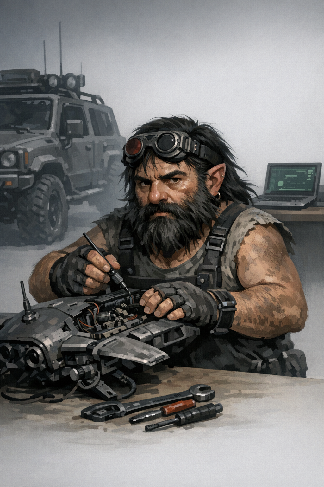

# Taco

## Overview

Recurring NPC contact who runs a large vehicle repair/salvage operation and is especially important to Curtis.

## Known Facts

- Taco is an NPC and ex-PC.
- He runs a large vehicle repair / salvage operation.
- He is an active contact for the group.
- Curtis is explicitly noted as an ally and student of Taco.
- By **2026-05-28**, Taco's property was being considered as possible support infrastructure for a future **Core 7** dolphin relocation/rescue plan.

## Relationships

- Linked strongly to **Curtis** as mentor/ally.
- Connected to the crew through logistics, vehicles, and repair/salvage support.
- Potentially connected to the **Core 7 / Site 7** fallout through Curtis's effort to prepare a possible dolphin habitat/landing space there.

## Relevant Sessions

- 2026-02-27 — authoritative roster/contact update.
- 2026-05-28 — surfaced as a practical logistics base for possible dolphin extraction planning.

## Open Questions

- How much direct operational support can Taco provide in the current arc?
- What resources from his operation are reliably available to the crew?
- Could Taco actually host or support the life-support needs of a relocated cybered dolphin node?

## Sources

- `memory/2026-02-27.md`
- `PARTY_DOSSIER.md`
- [Session 2026-05-28](../Sessions/2026-05-28.md)
