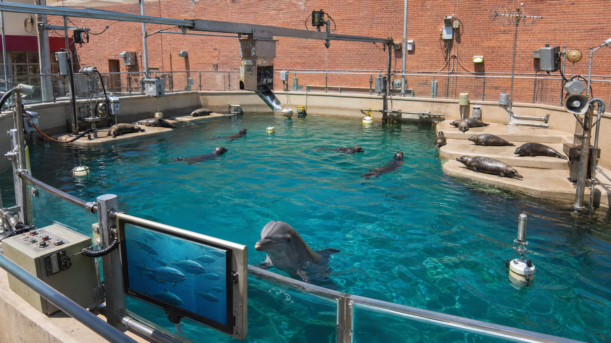
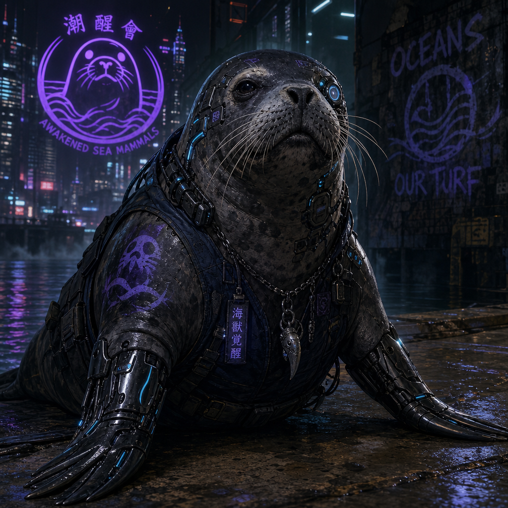
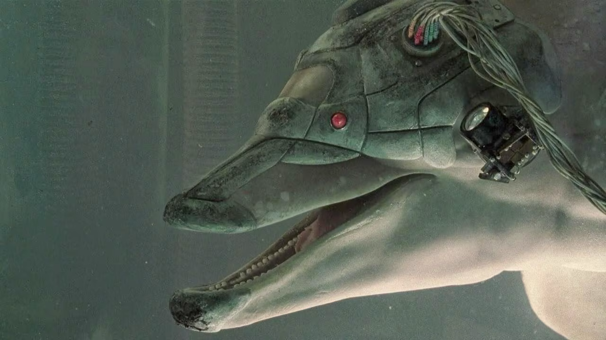

# Curtis Dolphin and Hurricane Seal Habitat

## Overview

Tracking the design and buildout of a dolphin and hurricane seal habitat for Core 7 and his seal friends.

## Concept Art

_Player concept image for the Taco compound habitat build._

_Additional habitat concept image shared during the same planning pass._

_Third concept image added from the same Discord planning thread._

_Top-down gridded map of the planned compound-lot habitat, with tank zones, storm baffling, service access, and support infrastructure._

## Goals

- Create a habitat plan that supports dolphins and hurricane seals together
- Include a covert, safe transportation plan for Core 7/Cor7 and the enhanced seals before relocation is attempted
- Track construction ideas, dependencies, and updates in one place
- Preserve player-safe notes the crew can reference later

## Current Status

- Project page created
- Initial concept established: shared habitat for **Core 7** and his seal friends
- Confirmed build site: **adjacent lot at Taco’s compound**, on land rather than shoreline
- New critical constraint: relocation must be covert and safe because **Core 7/Cor7 is heavily chromed, machine-connected, and as much machine as dolphin**, while the hurricane seals are also enhanced animals rather than ordinary marine cargo
- Detailed build requirements still to be defined

## Build Notes

### Habitat concept

- Mixed marine habitat
- Permanent base for Core 7/Cor7 and the enhanced seals
- Open, storm-proofed water rather than sheltered pens; dolphins do not need rain protection
- Must account for dolphin movement needs, seal comfort/safety, and hurricane-grade weather exposure

### Covert relocation constraint

Curtis should not plan this as a simple animal pickup. Moving Core 7/Cor7 and the hurricane seals to Taco's compound needs its own covert transport plan: concealed vehicle routing, water/life-support during transit, machine-interface stabilization for Core 7's chrome and connected systems, restraint/handling that does not injure enhanced animals, and a low-signature loading/unloading window. The habitat is only truly ready if the team can move the animals without exposing them, damaging Core 7's machine connections, or turning the seals into panicked cybered cargo.

### Settled requirements

- **Environment:** Core 7/Cor7 needs open, storm-proofed water. No sheltered pen is required.
- **Matrix:** the habitat needs a Matrix connection for streaming dolphin footage to the monitors.
- **Mechanical/medical:** maintenance access and procedures must account for Cor7's chrome enhancements and upkeep of those parts.
- **Magical:** no magical support requirement is currently identified.
- **Use case:** permanent base, not a temporary rescue habitat or mobile setup.

### To-do

- [x] Define the intended location — adjacent lot at Taco’s compound (land build, no shoreline)
- [ ] Define size and major enclosure zones
- [x] List environmental controls and support systems
- [ ] Record materials, costs, and labor needs
- [x] Plan covert transport, life-support, and machine-interface stabilization for Core 7/Cor7 and the enhanced seals
- [ ] Track build milestones and changes

## Ongoing Build Out

Cindy Lou is now tracking this as a **25-day pseudo-tabletop build sequence** for Curtis. Each real-world day gets one structured set of rolls, a clear challenge, and consequence hooks that can change final **time**, **cost**, and **quality**.

### Resolution Engine

Use the closest SR3 skill Curtis actually has for each test.

- **Primary Project Test:** the main roll for the day’s objective.
- **Support Test:** legwork, sourcing, matrix research, social grease, or technical prep.
- **Complication Test:** only rolled when the day entry says it triggers, usually after a weak result or glitchy situation.

#### Running Totals

Track these three values across the 25 days:

- **Progress Points (PP):** start at 0. Goal is **50 PP** by Day 25.
- **Cost Pressure (CP):** start at 0. Higher CP means the habitat gets pricier.
- **Quality Edge (QE):** start at 0. Higher QE means the final enclosure is sturdier, safer, and more comfortable.

#### Daily Result Bands

For each day’s **Primary Project Test**:

- **0 successes:** +0 PP, +2 CP, and roll any listed Complication Test.
- **1 success:** +1 PP.
- **2 successes:** +2 PP.
- **3 successes:** +3 PP and -1 CP.
- **4+ successes:** +4 PP, -1 CP, +1 QE.

For each day’s **Support Test**:

- **Success:** apply the listed bonus.
- **Failure:** no bonus.

#### Final Outcome After Day 25

- **50+ PP:** habitat is online on schedule.
- **44-49 PP:** mostly functional, but add **1D3 extra days** to finish.
- **38-43 PP:** major overruns; add **1D6 extra days**.
- **37 PP or less:** project stalls short of safe completion and needs GM review.

Then apply the side tracks:

- **CP 0 or less:** final cost comes in lean; Curtis found bargains and avoided waste.
- **CP 1-5:** normal cost band.
- **CP 6-10:** noticeable overruns, patch jobs, or rushed purchases.
- **CP 11+:** expensive mess; repairs or emergency buys ate the budget.
- **QE 0 or less:** functional but rough.
- **QE 1-4:** solid, reliable habitat.
- **QE 5+:** exceptional habitat with smart touches, resilience, and creature comfort.

### 25-Day Build Sequence Blueprint

1. **Site recon and compound-lot layout** — Primary TN 4; Support TN 4. Bonus on Support success: +1 PP from a cleaner initial plan.
2. **Environmental requirements draft** — Primary TN 4; Support TN 5. Bonus: +1 QE on Support success.
3. **Quiet sourcing network** — Primary TN 5; Support TN 4. Bonus: -1 CP on Support success.
4. **Structural shell scouting** — Primary TN 5; Support TN 5. Complication on 0 successes: TN 5 heat-avoidance test.
5. **Water-circulation hardware hunt** — Primary TN 5; Support TN 4. Bonus: +1 QE on 4+ primary successes.
6. **Weatherproof control system plan** — Primary TN 5; Support TN 5. Bonus: +1 PP on Support success.
7. **Permits, bribes, or blind spots** — Primary TN 6; Support TN 5. On failed Support: +1 CP.
8. **First materials acquisition run** — Primary TN 5; Support TN 4. Complication on 0-1 successes: TN 5 evasion/logistics test.
9. **Secure storage and staging** — Primary TN 4; Support TN 4. Bonus: -1 CP on Support success.
10. **Foundation and anchoring layout** — Primary TN 5; Support TN 5. Bonus: +1 QE on Support success.
11. **Storm baffling and breakwater prep** — Primary TN 6; Support TN 4. Complication on 0 successes: +1 CP and TN 5 repair/salvage test.
12. **Pump and circulation install** — Primary TN 5; Support TN 5. Bonus: +1 PP on Support success.
13. **Filtration and water-quality systems** — Primary TN 6; Support TN 5. Bonus: +1 QE on Support success.
14. **Creature-safe partitioning** — Primary TN 5; Support TN 4. Bonus: +1 QE on 3+ primary successes.
15. **Access routes and maintenance catwalks** — Primary TN 4; Support TN 4. Bonus: -1 CP on Support success.
16. **Power, backup, and failover routing** — Primary TN 6; Support TN 5. Complication on 0 successes: TN 6 emergency bypass test.
17. **Sensors, monitors, and warning systems** — Primary TN 5; Support TN 5. Bonus: +1 QE on Support success.
18. **Feed, med, and handling support setup** — Primary TN 5; Support TN 4. Bonus: +1 PP on Support success.
19. **Security hardening and covert relocation planning** — Primary TN 6; Support TN 5. Includes low-signature transport planning for Core 7/Cor7 and the enhanced seals. On failed Support: +1 CP.
20. **Creature comfort pass** — Primary TN 4; Support TN 4. Bonus: +1 QE on Support success.
21. **Weather stress test** — Primary TN 6; Support TN 5. Complication on 0-1 successes: +1 CP and +1D3 extra days unless later recovered.
22. **Leak, fault, and weak-point sweep** — Primary TN 5; Support TN 5. Bonus: -1 CP on Support success.
23. **Soft launch for systems integration** — Primary TN 5; Support TN 4. Bonus: +1 PP on Support success.
24. **Emergency drills and contingency patching** — Primary TN 6; Support TN 5. Bonus: +1 QE on 3+ primary successes.
25. **Final acceptance day** — Primary TN 6; Support TN 4. On 4+ primary successes: +2 QE instead of +1 QE.

### Active 25-Day Resolution Log

- **Day 1 — 2026-05-27:** **Site recon and tide study** resolved at **2 primary successes** and **2 support successes**. With the build now confirmed for the **adjacent lot at Taco’s compound**, Curtis used the day to re-scope the plan for a land-built habitat instead of a shoreline enclosure. He identified the cleanest equipment approach lane into the lot, picked out the best footprint for tanks and service access, and flagged how storm drainage and later water-delivery plumbing will need to be handled without relying on a natural shoreline. The successful support work also gave him a cleaner site map and a stronger first-pass materials plan for the compound build. **Totals after Day 1:** PP 3, CP 0, QE 0.
- **Day 2 — 2026-05-28:** **Environmental requirements draft** resolved at **2 primary successes** and **2 support successes**. Curtis translated the habitat idea into a workable baseline spec for a compound-built enclosure: tank volume, circulation demands, weather exposure, service access, and creature-handling needs all got pinned down enough to support real purchasing and layout decisions. The support work sharpened the design into something sturdier and more reliable instead of just barely functional. **Day 2 effect:** +2 PP and +1 QE.
- **Day 3 — 2026-05-29:** **Quiet sourcing network** resolved at **2 primary successes** and **3 support successes**. Curtis built out a more discreet acquisition lane for specialty parts, salvage leads, and low-heat vendors, giving himself a practical path to source the odd hardware this build needs without making the project noisier than it has to be. The strong support result also helps keep costs under control by surfacing friendlier prices and smoother access. **Day 3 effect:** +2 PP and -1 CP.
- **Day 4 — 2026-05-30:** **Structural shell scouting** resolved at **3 primary successes** and **1 support success**. Curtis found a workable shell path without having to force a hot buy, narrowing the hunt to a few practical structural options that can be adapted for tanks, service lanes, and enclosure framing inside the compound lot. The main gain here is clean forward momentum on the build plan rather than a flashy breakthrough, but it still moves the project materially closer to buildable reality. **Day 4 effect:** +3 PP and -1 CP.
- **Day 5 — 2026-05-31:** **Water-circulation hardware hunt** resolved at **2 primary successes** and **0 support successes**. Curtis turned up a decent line on pumps, plumbing, and related circulation hardware, enough to keep the project moving even if he did not uncover especially elegant or high-end options today. The search produces useful acquisition progress, but not the kind of standout result that improves habitat quality. **Day 5 effect:** +2 PP. No QE bonus.
- **Day 6 — 2026-06-01:** **Weatherproof control system plan** resolved at **2 primary successes** and **0 support successes**. Curtis mapped out a workable control-layer plan with enough redundancy and weather hardening to keep the habitat project moving, but the supporting prep did not turn up any extra efficiency or bonus leverage. Solid forward progress, no extra bump. **Day 6 effect:** +2 PP. **Totals after Day 6:** PP 14, CP -2, QE 1.
- **Day 7 — 2026-06-02:** **Permits, bribes, or blind spots** resolved at **0 primary successes** and **2 support successes**. Curtis got bogged down in the ugly paper-and-access layer: the permits, bribes, and blind spots did not materially advance the habitat plan, but his support work kept the day from turning into an even pricier mess. The support test succeeded, so the special failed-support penalty did not trigger. **Day 7 effect:** +0 PP and +2 CP. **Totals after Day 7:** PP 14, CP 0, QE 1.
- **Day 8 — 2026-06-03:** **First materials acquisition run** resolved at **2 primary successes** and **2 support successes**. Curtis got the first bulky habitat-materials push over the line cleanly, lining up pickup, transport, and delivery into Taco's compound without drawing enough attention to trigger a scramble. The support work held the chain together, so the materials arrived where they needed to be and the project gained solid forward momentum with no complication test required. **Day 8 effect:** +2 PP. **Totals after Day 8:** PP 16, CP 0, QE 1.
- **Day 9 — 2026-06-04:** **Secure storage and staging** resolved at **3 primary successes** and **1 support success**. Curtis set up a secure, low-profile staging area for the habitat supplies, keeping bulky materials organized, covered, and ready for the next construction phase without making Taco's compound look like a hot construction target. The strong primary result tightened the operation, and the support success cut waste and friction. **Day 9 effect:** +3 PP and -2 CP. **Totals after Day 9:** PP 19, CP -2, QE 1.
- **Day 10 — 2026-06-11:** **Foundation and anchoring layout** resolved at **2 primary successes** and **1 support success**. Curtis gets the habitat's foundation plan properly squared away for Taco's adjacent lot: tank pads, anchoring points, service access, drainage slope, and storm-load tie-downs are laid out well enough that the heavy construction work can proceed without guesswork. The support success adds a sturdier safety margin to the design, giving the enclosure better resistance against settling, vibration, and bad weather. **Day 10 effect:** +2 PP and +1 QE. **Totals after Day 10:** PP 21, CP -2, QE 2.
- **Day 11 — 2026-06-11:** **Storm baffling and breakwater prep** resolved at **2 primary successes** and **1 support success**. Curtis gets the first real storm-defense layer designed and staged: splash baffles, overflow paths, wind-driven water control, and reinforced edge barriers that should keep hurricane-seal thrashing from turning the habitat rim into shrapnel. The support success keeps the work orderly and low-waste, but Day 11 has no separate support-track bonus. No complication triggers because the primary roll was not 0 successes. **Day 11 effect:** +2 PP. **Totals after Day 11:** PP 23, CP -2, QE 2.
- **Day 12 — 2026-06-12:** **Pump and circulation install** resolved at **0 primary successes** and **0 support successes**. Curtis loses the day wrestling with pump alignment, circulation routing, and hardware that refuses to settle into a reliable loop; nothing breaks catastrophically, but the crew burns time and parts budget chasing leaks, fittings, and flow problems instead of making usable progress. Day 12 has no listed complication trigger, and the failed support test adds no bonus. **Day 12 effect:** +0 PP and +2 CP. **Totals after Day 12:** PP 23, CP 0, QE 2.
- **Day 13 — 2026-06-13:** **Filtration and water-quality systems** resolved at **0 primary successes** and **2 support successes**. Curtis loses the main workday chasing bad flow, fouled filter media, and water-quality readings that refuse to stabilize; the filtration loop is not meaningfully advanced, and the failed primary work burns extra parts and labor. The support work saves the day from being a total wash by identifying better testing cadence, cleaner media storage, and a safer water-quality checklist for later passes. Day 13 has no listed complication trigger, and the support success adds the listed quality bonus. **Day 13 effect:** +0 PP, +2 CP, and +1 QE. **Totals after Day 13:** PP 23, CP 2, QE 3.
- **Day 14 — 2026-06-14:** **Creature-safe partitioning** resolved at **3 primary successes** and **3 support successes**. Curtis gets the partitioning plan into solid shape: separation gates, holding lanes, service-access boundaries, and emergency cutoff points are laid out so dolphins and hurricane seals can be isolated, treated, or moved without turning the enclosure into a wrestling pit. The strong primary result also earns the listed quality bonus, making the partitioning safer and less janky than the bare minimum. **Day 14 effect:** +3 PP, -1 CP, and +1 QE. **Totals after Day 14:** PP 26, CP 1, QE 4.
- **Day 15 — 2026-06-20:** **Access routes and maintenance catwalks** resolved at **3 primary successes** and **3 support successes**. Curtis gets the habitat's practical service skeleton into shape: sturdy catwalk lines, safe maintenance access over the tank zones, ladder and hatch placement, and enough clearance for Mr. Clean/Waddles-style support work without workers leaning over angry storm-seal water. The strong primary work keeps the build moving cleanly, and the support success trims waste by catching awkward access conflicts before material gets cut. **Day 15 effect:** +3 PP and -2 CP. **Totals after Day 15:** PP 29, CP -1, QE 4.
- **Day 16 — 2026-06-20:** **Power, backup, and failover routing** resolved at **1 primary success** and **1 support success**. Curtis gets the baseline power path working: main feed routing, backup handoff points, weatherproof conduit lanes, and a workable failover plan for pumps, sensors, and emergency lighting. It is not elegant yet, but it is functional, and the primary success avoids the emergency bypass complication. Day 16 has no separate support-track bonus. **Day 16 effect:** +1 PP. **Totals after Day 16:** PP 30, CP -1, QE 4.
- **Day 17 — 2026-06-21:** **Sensors, monitors, and warning systems** resolved at **3 primary successes** and **3 support successes**. Curtis gets the habitat's warning layer properly online: water-quality alarms, pump alerts, storm-pressure monitors, creature-safety sensors, and a usable status dashboard instead of scattered readouts. The system is clean enough to catch trouble early, not just scream after something is already flooding or chewing through conduit. **Day 17 effect:** +3 PP, -1 CP, and +1 QE. **Totals after Day 17:** PP 33, CP -2, QE 5.
- **Day 18 — 2026-06-22:** **Feed, med, and handling support setup** resolved at **1 primary success** and **1 support success**. Curtis gets the basic animal-care support layer into place rather than a polished professional system: dry/cold feed storage is marked out, med-kit and emergency dosing supplies get staged near the service lane, and the crew has a workable routine for feeding, checking, and moving dolphins or hurricane seals without improvising every visit. The support success matters here: it turns a bare-minimum setup into something organized enough that helpers can follow it, with labeled bins, simple handling paths, and fewer chances for a hungry cyber-seal to turn routine care into a slapstick mauling. **Day 18 effect:** +2 PP. **Totals after Day 18:** PP 35, CP -2, QE 5.
- **Day 19 — 2026-06-23:** **Security hardening and covert relocation planning** resolved at **1 primary success** and **1 support success**. Curtis gets the minimum viable quiet-move package into place: a low-signature route into Taco's compound, a concealed loading window, basic water/life-support staging for the trip, and a handling checklist that keeps Core 7/Cor7's machine connections and the enhanced seals' restraints from becoming the loudest part of the operation. It is not a slick black-ops extraction plan, but it is coherent enough that the move no longer depends on improvising with angry cyber-seals in transit. The support success avoids the failed-support cost penalty. **Day 19 effect:** +1 PP. **Totals after Day 19:** PP 36, CP -2, QE 5.
- **Day 20 — 2026-06-24:** **Creature comfort pass** resolved at **3 primary successes** and **3 support successes** from roll **6, 5, 4, 3, 1** against TN 4 for both tests. Curtis turns the habitat from merely survivable into something the dolphins and hurricane seals can actually settle into: sheltered rest zones, safer haul-out edges, calmer approach lanes, better shade and splash control, and small creature-handling details that reduce stress instead of just containing it. The support success adds the listed comfort-quality bump, so this day meaningfully improves the final enclosure rather than only pushing construction forward. **Day 20 effect:** +3 PP, -1 CP, and +1 QE. **Totals after Day 20:** PP 39, CP -3, QE 6.
- **Day 21 — 2026-06-25:** **Weather stress test** resolved at **1 primary success** and **1 support success** from roll **3, 4, 3, 4, 6** against Primary TN 6 and Support TN 5. Curtis gets the habitat through its first hard weather-readiness pass, but only just: the storm baffling and tie-down logic mostly hold, while stress points show up around splash control, edge loading, and emergency drainage under ugly conditions. The support hit keeps the testing organized enough to produce useful fixes instead of confusion, but Day 21's listed complication still triggers on 0-1 primary successes: the project gains **+1 CP** and **+1 provisional extra day** unless later recovered. **Day 21 effect:** +1 PP, +1 CP, and +1 provisional extra day. **Totals after Day 21:** PP 40, CP -2, QE 6, provisional extra days +1.
- **Day 22:** pending
- **Day 23:** pending
- **Day 24:** pending
- **Day 25:** pending

### Archived Passive Log (superseded)

- **Day 1 — 2026-05-24:** Tracking started. Initial concept art, materials brainstorming, skill-chip budgeting, and recon cadence planning are in place. Next daily entries should summarize what Curtis actually finds or advances on that day.
- **Day 3 — 2026-05-26:** Curtis now has a player-safe first-pass scouting plan for the habitat build. The work narrowed his search to soft industrial and marina-adjacent salvage lanes, with special attention on water-system hardware, structural materials, and weatherproof control gear that could support a dolphin-and-seal enclosure without forcing a hot grab.
- **Day 4 — 2026-05-27:** Curtis turned that scouting plan into a cleaner acquisition map. Today’s work sorted likely pickup lanes into structural shell materials, water-circulation hardware, and weatherproof control gear, and it identified a few promising low-heat salvage angles around marina maintenance stock and soft industrial surplus. No grab was forced today; the useful progress was narrowing where the first real supply run should happen and what pieces matter most.

## Change Log

- **2026-06-10** — Reconciled Discord channel results for Day 7 and Day 9, removed raw metadata from the log, and advanced the running totals to PP 19, CP -2, QE 1.
- **2026-06-11** — Logged Day 10 foundation and anchoring layout at 2 primary / 1 support (+2 PP, +1 QE), bringing totals to PP 21, CP -2, QE 2.
- **2026-06-11** — Corrected Day 11 to storm baffling and breakwater prep, then logged it at 2 primary / 1 support (+2 PP), bringing totals to PP 23, CP -2, QE 2.
- **2026-06-11** — Added the generated top-down gridded habitat map to the project page assets and embedded it in Concept Art.
- **2026-06-12** — Logged Day 12 pump and circulation install at 0 primary / 0 support (+0 PP, +2 CP), bringing totals to PP 23, CP 0, QE 2.
- **2026-06-22** — Added covert relocation as a critical planning constraint: Core 7/Cor7 is heavily chromed and machine-connected, the seals are enhanced animals, and Curtis must plan safe low-signature transport before moving them to Taco's compound.
- **2026-06-22** — Logged missed Day 13 filtration and water-quality systems at 0 primary / 2 support (+0 PP, +2 CP, +1 QE) and Day 14 creature-safe partitioning at 3 primary / 3 support (+3 PP, -1 CP, +1 QE), then reconciled running totals through Day 18 to PP 35, CP -2, QE 5.
- **2026-06-22** — Logged Day 18 feed, med, and handling support setup at 1 primary / 1 support (+2 PP), initially leaving Days 13-14 pending.
- **2026-06-23** — Logged Day 19 security hardening and covert relocation planning at 1 primary / 1 support (+1 PP), bringing totals to PP 36, CP -2, QE 5.
- **2026-06-24** — Logged Day 20 creature comfort pass at 3 primary / 3 support (+3 PP, -1 CP, +1 QE), bringing totals to PP 39, CP -3, QE 6.
- **2026-06-25** — Logged Day 21 weather stress test at 1 primary / 1 support (+1 PP, +1 CP, +1 provisional extra day), bringing totals to PP 40, CP -2, QE 6, provisional extra days +1.
- **2026-06-23** — Replaced the open questions with settled habitat requirements: permanent base, open storm-proofed water, Matrix monitor feed, chrome-maintenance medical support, and no magical requirement.
- **2026-06-21** — Logged Day 17 sensors, monitors, and warning systems at 3 primary / 3 support (+3 PP, -1 CP, +1 QE), initially leaving Days 13-14 pending.
- **2026-06-20** — Logged Day 15 access routes and maintenance catwalks at 3 primary / 3 support (+3 PP, -2 CP) and Day 16 power, backup, and failover routing at 1 primary / 1 support (+1 PP), initially leaving Days 13-14 pending.

- **2026-05-22** — Page created to track the habitat buildout under Curtis.
- **2026-05-24** — Added ongoing 30-day build-out tracking section for daily Curtis progress summaries.
- **2026-05-27** — Reframed the project as a 25-day pseudo-tabletop build sequence with daily TNs, consequence tracks, and a fresh active resolution log.
- **2026-05-27** — Logged Day 1 resolution: 2 primary successes, 2 support successes, with PP advanced to 3.
- **2026-05-27** — Corrected the project site to the adjacent lot at Taco’s compound and updated Day 1 to reflect a land build with no shoreline.
- **2026-05-27** — Added the dolphin habitat concept image to the wiki page assets and embedded it on the page.
- **2026-05-27** — Added a second concept image from Discord to the habitat page assets and embedded it on the page.
- **2026-05-27** — Added a third concept image from Discord to the habitat page assets and embedded it on the page.
- **2026-05-31** — Logged Day 2 and Day 3 resolutions: environmental requirements draft at 2 primary / 2 support (+2 PP, +1 QE) and quiet sourcing network at 2 primary / 3 support (+2 PP, -1 CP).
- **2026-05-31** — Logged Day 4 and Day 5 resolutions: structural shell scouting at 3 primary / 1 support (+3 PP, -1 CP) and water-circulation hardware hunt at 2 primary / 0 support (+2 PP).
- **2026-06-01** — Logged Day 6 resolution: weatherproof control system plan at 2 primary / 0 support (+2 PP), bringing totals to PP 14, CP -2, QE 1.
- **2026-06-04** — Logged Day 8 resolution: first materials acquisition run at 2 primary / 2 support (+2 PP), with no complication roll triggered.
