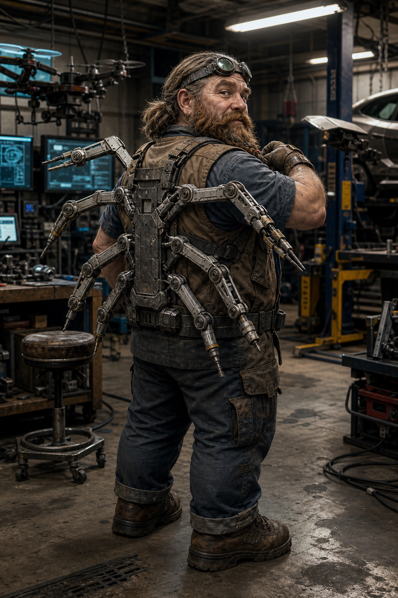

# Curtis

## Overview

Active player character, **dwarf**, and the crew's drone-and-vehicle rigger.

## Attributes

- **BOD 4**
- **QUI 6**
- **STR 5**
- **CHA 1**
- **INT 6**
- **WIL 5**
- **Reaction 5**
- **Initiative 5+1D6**
- **Essence 1.84**
- **Magic -**

## Active Skills

Show active skills

- **Pistols 3**
- **Gunnery 5**
- **Whips 3**
- **Mech Bladed Weapons 4**
- **Diving 2**
- **Etiquette 4**
- **Electronics 6**
- **Computer 3**
- **SU Tactics/V Tactics 1/4**
- **Electronics Build/Repair 1**
- **Car 4**
- **Motorboat 3**
- **Submarine 2**
- **Rotor Aircraft/RO 1/5**
- **Tracks/RO 1/5**
- **Vector Thrust Aircraft/RO 1/5**
- **Walkers/RO 1/5**
- **Rotor Aircraft B/R 3**
- **Submarine B/R 2**
- **Vector Thrust Aircraft B/R 3**
- **Car B/R 3**

## Knowledge & Language Skills

Show knowledge and language skills

- **Smuggler Havens (KNO) 3**
- **Smuggling Routes (KNO) 4**
- **AC: Gunsmithing (KNO) 2**
- **SV: Navigation (KNO) 4**
- **Assault Rifles (KNO) 2**
- **Heavy Weapons (KNO) 2**
- **Submachine Guns (KNO) 2**
- **Car (KNO) 3**
- **Fixed Wing (KNO) 2**
- **Hovercraft (KNO) 2**
- **Submarines (KNO) 3**
- **Vectored Thrust Aircraft (KNO) 2**
- **IN: Elven Wines (KNO) 2**
- **IN: Investing (KNO) 4**
- **IN: Poetry (KNO) 2**
- **English (LAN) 3**
- **English (LAN) (R/W) 1**
- **Mathematics 4**

## Known Facts

- Curtis is played by **Lee**.
- He is a **dwarf** and the crew's **drone and vehicle rigger**.
- Current sheet-backed core stats: **BOD 4**, **QUI 6**, **STR 5**, **CHA 1**, **INT 6**, **WIL 5**, **Essence 1.84**, **Reaction 5**, **Initiative 5+1D6**, **Magic -**.
- Key crew tags: **Very Short**, **Ex-Caribbean Smuggler**.
- He is an ally and student of [Taco](../NPCs/Taco.md).
- Current tracked Karma: **14 Karma** after the 2026-08-13 session award.
- Current tracked nuyen: **9,240¥**, before any GM-confirmed scorpion-drone recovery project costs.
- Current gear note preserved in dossier: **6 incendiary grenades** on hand after restock; **Defiance Super Shock taser** with **concealable holster** purchased 2026-07-16; **5 cans of SPAM** purchased 2026-07-16; **Backpack Arms rig** finalized 2026-08-05 for conservative light tool work only.
- He finished the [dolphin and hurricane seal habitat](Curtis-Dolphin-and-Hurricane-Seal-Habitat.md) for **Core 7** and the site's other aquatic creatures.
- By **2026-06-04**, that habitat work was active enough that Curtis was also staying in contact with **Core 7** through recurring fish deliveries.
- During the 2066-05-09 interlude, Curtis backed Kurgan on the **Righteous Haze** job, using **Grandpa** as the lure/extraction vehicle.
- Curtis earned **4 Karma** and **5,000¥ total payout / recovered value** from the Righteous Haze interlude.
- During the Pixel Sticks investigation at Happy Cat, Curtis used Belmont to spot suspicious roof equipment, identified the laser modem path into the neighboring arkoblock, paid the 100¥ store-membership shakedown, and used Mr. Clean to unlatch a sealed stairwell barricade from the inside.
- During the 2026-07-23 21st-floor breach, Curtis helped interpret and manipulate the scorpion combat drone's control setup with Mevin, added the crew to the whitelist, repaired/reactivated the sealed elevator enough for escape, and later wanted to search for Matrix/news sightings of Chunky Sparkles.
- During the 2026-08-06 player-driven follow-up, Curtis tracked and recovered the damaged Pixel Sticks scorpion drone with Kurgan, used Belmont and The Finisher during the Highwaymen fight, and accepted the drone as a long-term staged rebuild / nuyen-sink project rather than an immediate asset.
- During the 2026-08-13 Wyrmwatch / Chunky Sparkles follow-up, Curtis used drone overwatch from Grandpa at Radnor Lake, helped identify the gator-like predator near Chunky Sparkles, and helped lure Chunky Sparkles out with food and vehicle support.

## Karma And Nuyen Ledger

- **Known current Karma:** **14 Karma** after the 2026-08-13 session award.
- **Known current nuyen:** **9,240¥**, before any GM-confirmed scorpion-drone recovery project costs.

Show Karma and nuyen history

- **Current Karma history:** **40 Karma** tracking baseline set on 2026-08-05 by Discord request; **-15 Karma** spent on 2026-08-05 to buy **Mech Bladed Weapons 4**, leaving **25 Karma**; **-12 Karma** spent on 2026-08-05 to raise **Intelligence from 5 to 6**, leaving **13 Karma**; current Karma set to **3 Karma** by Discord request on 2026-08-06; **+7 Karma** awarded for Session 2026-08-06, leaving **10 Karma**; **+4 Karma** awarded for Session 2026-08-13, leaving **14 Karma**. Earlier wiki-tracked awards remain listed below as provenance, but the running count starts from the explicit 40-Karma baseline.
- **Current nuyen history:** **210¥** after retrofit spending, then **+450¥** added on 2026-04-30, **+5,000¥** added and **-5,000¥** spent on Grandpa's morphing license plate on 2026-06-26, **+5,000¥** from a side mission with unretro, **-2,700¥** for a Rating 3 aquatic filtration / marine life-support knowsoft, **+15,000¥** from the Griswell / Alvin / Palermo job on 2026-07-02, **+55¥** net from completed Curtis Drone Shift / Morning Garage Work Orders, **-10,800¥** for Grandpa's GM-approved flood rescue / short-dunk package on 2026-07-16, **-3,500¥** for Grandpa's crash cage on 2026-07-16, **-3,200¥** for Grandpa's flood ballast kit on 2026-07-16, **-475¥** for a Defiance Super Shock taser plus concealable holster on 2026-07-16, **-20¥** for Mr. Clean's climbing cleat kit on 2026-07-16, **-10¥** for 5 cans of SPAM on 2026-07-16, **+28,780¥** net from the Saab Dynamit 778 TI sale after Taco's cut and Finisher ammunition restock on 2026-07-19, **-3,000¥** in thank-you cuts to Mevin, Valgaut, and Kurgan for helping boost the car on 2026-07-19, **+15,000¥** from the Pixel Sticks / Military-Grade Utilities payout on 2026-07-23, **-1,300¥** Backpack Arms Build Day 1 project spend on 2026-07-24, **-1,600¥** Backpack Arms Build Day 2 project spend on 2026-07-25, **-3,000¥** Backpack Arms Build Day 4 project spend on 2026-07-26, **-2,900¥** Backpack Arms Build Day 6 project spend on 2026-07-27, **-4,150¥** Backpack Arms Build Day 7 project spend on 2026-07-28, **-3,000¥** Backpack Arms Build Day 8 project spend on 2026-07-29, **-2,800¥** Backpack Arms Build Day 9 project spend on 2026-07-30, **-2,200¥** Backpack Arms Build Day 10 project spend on 2026-07-31, **-3,250¥** Backpack Arms Build Day 13 project spend on 2026-08-02, **-7,500¥** for Grandpa's Photovoltaic Chameleon Paint kit and install on 2026-08-02, **-4,850¥** Backpack Arms Build Day 14 final acceptance project spend on 2026-08-05, **-50¥** Morning Garage Advanced Drone Pilot retrieval Day 1 inventory spend on 2026-08-12, and **-75¥** Morning Garage Advanced Drone Pilot retrieval Day 2 checklist spend on 2026-08-13, and **+5,000¥** from the Wyrmwatch / Chunky Sparkles follow-up on 2026-08-13.
- **2026-06-25 — Righteous Haze interlude:** **+4 Karma**, **+5,000¥** total payout / recovered value.
- **2026-07-23 — Pixel Sticks / Military-Grade Utilities Run:** **+7 Karma**, **+15,000¥**.
- **2026-08-06 — Scorpion drone recovery:** **+7 Karma**, no nuyen payout recorded; recovered the damaged scorpion drone as a long-term project.
- **2026-08-13 — Wyrmwatch / Chunky Sparkles follow-up:** **+4 Karma**, **+5,000¥**; supported Radnor Lake drone overwatch and extraction.

## Rigger Asset Highlights

- [Grandpa](../Locations/Grandpa.md) — Ford-Canada Bison RV / BusMod base
- [Belmont](../Vehicles/Belmont.md) — GM Nissan Doberman
- [The Finisher](../Vehicles/The-Finisher.md) — MCT Nissan Roto-Drone
- [Buzz](../Vehicles/Buzz.md) — generic surr drone
- [Mr. Clean](../Vehicles/Mr-Clean.md) — GMM Fix-It
- [Waddles](../Vehicles/Waddles.md) — Ares Felix SynthCat
- [Backpack Arms rig](Curtis-Backpack-Arms-Build.md) — finalized wearable six-arm backpack utility rig for conservative light tool work; strict folded-carry, slow-deploy, socket, load, and maintenance limits apply.

### Backpack Arms Usage Guide

Curtis's Backpack Arms rig is accepted as garage-built wearable utility gear for conservative light tool work, not cyberware and not a combat extra-action system. The final build cost was **29,050¥** across the Drone Shift project track.

- **Carry and deployment:** The rig rides as a compact backpack profile with strict folded-carry limits. Deployment is deliberately slow and manual-sequenced; Curtis must check locks, sockets, and safety stops before treating any arm as usable.
- **Tool sockets:** Universal wrist sockets are allowed for light tools and dummy-tool-equivalent loads only. Socket labels, visible manual sequencing, the Day 10 conservative single-arm load card, and the stricter final load limit remain binding until the GM expands them.
- **Combat limits:** No extra natural limbs, extra attacks, reach bonus, free bracing, or autonomous combat effects apply. Combat end effectors are not approved by this acceptance packet unless the GM later writes a separate allowance.
- **Safety and maintenance:** Safety cutoffs must stay reachable. The rig uses documented lined sleeves, edge guards, replacement guards, simple spring detents, and manual lock checks; after rough use, snagging, socket resets, or heavy tool strain, Curtis should recheck guards, sockets, bushings, and the reused-ballast safe-load witness before relying on it again.
- **SR3 effects:** Approved campaign effect is access to the described light utility-tool rig under these limits. Any dice bonus, action-economy change, reach effect, concealability ruling, damage threshold, or arm-disabled condition requires explicit GM confirmation.

## Relationships

- Linked to [Taco](../NPCs/Taco.md).
- Linked to the crew's mobility, drone, and extraction infrastructure.

## Projects

- [Backpack Arms Build](Curtis-Backpack-Arms-Build.md) — completed GM-approved 14-day Drone Shift diversion track for a retractable six-arm wearable utility rig. Final accepted project spend is **29,050¥**; approved scope is conservative light tool work only.
- [Dolphin and Hurricane Seal Habitat](Curtis-Dolphin-and-Hurricane-Seal-Habitat.md) — finished habitat for Core 7 and his seal friends at Taco's compound, with storm-proofed water, Matrix monitor feeds, maintenance access, and covert-relocation constraints preserved.

## Drone Shift

- [Curtis Drone Shift](https://hanclintoclaw-pixel.github.io/curtis-drone-shift/) rotates daily downtime Work Orders. The Backpack Arms diversion track completed on 2026-08-05 with final conservative tool-rig acceptance; completed routine reports stay logged and small routine nuyen deltas are applied to Curtis's running total. Missed/untouched copies are discarded with no nuyen movement, no drone state change, and no penalty; permanent drone/vehicle/equipment/combat/stat changes still require GM confirmation.

### Completed Work Orders

Show completed Drone Shift work-order history

- **2026-07-13 — Tutorial 2: Grandpa's Back-Step Rattle**: Curtis completed Taco's Grandpa back-up rattle ticket as a solid repair. Final report logged **-25¥** net shift result and **Maintenance Quality 3**; no permanent Grandpa/drone stat changes apply unless the GM confirms them.
- **2026-07-14 — Tutorial 3: Belmont's Track-Tension Creep**: Curtis completed Taco's Belmont track-tension ticket as a clean shop win. Final report logged **+60¥** net shift result and **Maintenance Quality 7** after cleaning a grit-packed adjuster screw, replacing the walking washer with spare-bin shim work, and resetting the track run; no permanent Belmont/drone stat changes apply unless the GM confirms them.
- **2026-07-15 — Tutorial 4: Mr. Clean's Screw-Snack Rattle**: Curtis completed Taco's Mr. Clean screw-rattle ticket as a solid repair. Final report logged **+5¥** net shift result and **Maintenance Quality 4** after bounding the clink to the belly-pan channel, identifying the missing brush-guard screw, fishing it out with a flex magnet, burning extra cleaner and foam tape chasing grit/buzz, and closing with a clean sweep-loop report. Follow-up note: the improvised fast magnet retrieval leaves **Calibration TN +1** for hidden grit risk; no permanent Mr. Clean/drone stat changes apply unless the GM confirms them.
- **2026-07-16 — Tutorial 5: Waddles' Fuzzy Sensor Sneezes**: Curtis completed Taco's Waddles rangefinder-sneeze ticket as a solid repair. Final report logged **+5¥** net shift result and **Maintenance Quality 3** after isolating the twitch to the left rangefinder pod, cleaning through a fuzzy blind spot with extra swabs, reusing and reseating the cleaned gasket, confirming Waddles avoided chair legs cleanly, and closing with a small Taco shop-credit thank-you. Follow-up note: the reused gasket leaves **Sensor Sweep TN +1** for lint-shadow risk on future related work-order checks; no permanent Waddles/drone stat changes apply unless the GM confirms them.

- **2026-07-17 — Tutorial 6: Buzz's Battery-Bay Bellyache**: Curtis completed Taco's Buzz ticket as a break-even maintenance. Final report logged **-25¥** net shift result and **Maintenance Quality 1** after Curtis rules out cell swelling and keeps the job in cheap latch-and-contact territory, The fault shows up late after Curtis cleans two innocent rails and donates extra contact swabs to the cause, The shim works, but Curtis spends extra tape and a replacement screw after the first bend fights back, and The check passes well enough, but Curtis spends extra foam and cleaner chasing one last warning-light flicker. Shimmed latch is in effect: hover-shake TN +1 for vibration risk. Follow-up note: Bend and shim the old latch: shimmed latch leaves vibration risk; Hover-Shake Test TN +1 and the final report notes the thrift fix. No permanent Buzz/drone stat changes apply unless the GM confirms them.

- **2026-07-21 — Waddles' Mud-Flap Chirp**: Curtis completed Taco's Waddles ticket as a break-even maintenance. Final report logged **+50¥** net shift result and **Maintenance Quality 2** after Curtis confirms the lead is dry, the pack is safe, and the chirp is mechanical instead of a wet-electronics tantrum, The squeak hides until Curtis cleans one innocent bracket and burns extra swabs finding the real hinge pin, The old strip trims clean, the hinge pin stops squeaking on the bench, and Waddles looks unfairly proud of the economy fix, and The test passes well enough, but Curtis spends extra bench time damping one last flap tick before Taco hears it. Reused hinge strip is in effect: puddle-waddle gait check TN +1 for thrift-fit fussiness. Follow-up note: Trim and reuse the hinge strip: reused hinge strip saves parts money but adds puddle-waddle gait check TN +1 and the final report notes the thrift fit. No permanent Waddles/drone stat changes apply unless the GM confirms them.

- **2026-07-22 — Buzz's Battery Clip Jiggle**: Curtis completed Taco's Buzz ticket as a break-even maintenance. Final report logged **+35¥** net shift result and **Maintenance Quality 2** after confirming the pack was safe with no swelling, tracing the fridge-rattle click to the tired spring tab after wasted shop time, crimping the original clip tight again without a new part, damping one last tray tick through the countertop vibration test, and brushing the tray before writing a clean ticket. Follow-up note: crimping the existing clip ears saved parts money but leaves **vibration test TN +1** for thrift-fit fussiness; no permanent Buzz/drone stat changes apply unless the GM confirms them.

- **2026-07-23 — Taco's Walk-In Fan Chirp**: Curtis completed Taco's walk-in cooler fan-guard ticket as a solid repair. Final report logged **+25¥** net shift result and **Maintenance Quality 4** after Curtis confirmed the blade path was clear and the noise was vibration instead of a fan chewing its own guard, pinned the chirp to two flattened grommets and a condensation-dusted connector clip, spent extra tape and a backup screw evening out the thrift-fit pressure, and put in extra bench time damping one last squeak before Taco heard it. Follow-up note: trimmed and reused old grommets saved parts money but leaves **door-slam spin test TN +1** for thrift-fit fussiness, with the final report noting the reused-grommet fit. No permanent equipment or drone stat changes apply unless the GM confirms them.

- **2026-07-24 — Grandpa's Glovebox Ground Hum**: Curtis completed Taco's Grandpa glovebox relay / dash-cam hum ticket as a break-even maintenance. Final report logged **+50¥** net shift result and **Maintenance Quality 2** after Curtis confirmed the circuit was safe, chased one innocent relay socket before finding the tired ground strap, braided a salvage ground strap, damped the last little buzz under the dash, and wrote a clean ticket. Follow-up note: the salvage ground strap saves parts money but leaves **accessory-load test TN +1** for thrift-fit fussiness on future related work-order checks; no permanent Grandpa/drone stat changes apply unless the GM confirms them.

- **2026-07-24 — Backpack Arms Build Day 1: Load-Path Coupons**: Curtis completed the first day of the GM-approved Backpack Arms 14-day diversion track as a solid repair / project setup. Final report logged **-1,300¥** project spend and **Maintenance Quality 4** after defining a believable folded six-arm carry envelope, redrawing the shoulder-to-hip load path after a failed Electronics B/R check, choosing usable aircraft aluminum salvage coupons after an expensive failed scrounge, successfully bend-testing one rail at **TN 6** due to salvage-stock uncertainty, and writing a clean phase-one spec. Follow-up note: the aircraft aluminum salvage path and overbought bushing stock carry forward into Day 2 / Day 4 planning; no permanent Backpack Arms gear, combat, or stat benefit applies until Day 14 final GM acceptance.

- **2026-07-25 — Backpack Arms Build Day 2: Backplate Skeleton Fit-Up**: Curtis completed the second day of the GM-approved Backpack Arms 14-day diversion track as a clean shop win. Final report logged **-1,600¥** project spend and **Maintenance Quality 7** after transferring the Day 1 rail cleanly while keeping mystery holes out of the load-bearing path, setting hip-belt bracket geometry so the spine carries vertical load while the belt catches twist, choosing the cheap fixed welded aluminum spine, hanging the skeleton straight enough for Day 3 folded-profile work, and writing a clear Day 2 skeleton sheet. Follow-up note: the fixed welded aluminum spine keeps Day 2 cheaper but raises the skeleton load-transfer test **TN +1** for salvage-stock and service-access uncertainty and adds a later folded-pack service-access warning; no permanent Backpack Arms gear, combat, or stat benefit applies until Day 14 final GM acceptance.

- **2026-07-26 — Backpack Arms Build Day 4: Arm Segment Pattern Bench**: Curtis completed the fourth day of the GM-approved Backpack Arms 14-day diversion track as break-even maintenance after the untouched Day 3 dummy-pack ticket rotated out with no spend or penalty. Final report logged **-3,000¥** project spend and **Maintenance Quality 2** after laying out six arm lanes around the hip-belt brackets and no-drill zones, choosing light drilled link patterns after two blanks oil-canned, recutting a wandering wrist-link master, setting a conservative reach envelope despite extra flex, and writing a clear Day 4 segment-pattern sheet. Follow-up note: light drilled links reduce immediate spend but leave a future maintenance-inspection warning; conservative reach improves reliability and keeps the final usage guide stricter; no permanent Backpack Arms gear, combat, or stat benefit applies until Day 14 final GM acceptance.

- **2026-07-27 — Backpack Arms Build Day 6: Rail Lock Detents**: Curtis completed the sixth day of the GM-approved Backpack Arms 14-day diversion track as a solid repair after the untouched Day 5 root-joint ticket rotated out with no spend, bonus, or penalty. Final report logged **-2,900¥** project spend and **Maintenance Quality 3** after re-squaring the folded rail envelope, choosing simple spring detents, recutting a chattered rail plate with a visible witness mark, setting a conservative rail stroke with a shim note for Day 7, and writing a clear rail-lock sheet. Follow-up note: simple spring detents require a manual lock-check warning in the final usage guide and raised the deployment safety test **TN +1**; conservative rail stroke simplifies Day 7 actuator setup and keeps the final guide stricter; no permanent Backpack Arms gear, combat, or stat benefit applies until Day 14 final GM acceptance.

- **2026-07-28 — Backpack Arms Build Day 7: Actuator Test Mule**: Curtis completed the seventh day of the GM-approved Backpack Arms 14-day diversion track as a clean shop win. Final report logged **-4,150¥** project spend and **Maintenance Quality 6** after confirming clean rail-stop actuator lanes, choosing electric micro-servos with predictable throw, recutting a walked mule-bracket tab, cycling the short-stroke deployment without bouncing the detents, and writing a clear actuator mule sheet. Follow-up note: electric micro-servos cost more now but simplify Day 8 power/control planning, improve final safety documentation, and reduce the actuator cycle test **TN -1** through cleaner documented response; the walked bracket tab flags the light link for closer fatigue inspection; no permanent Backpack Arms gear, combat, or stat benefit applies until Day 14 final GM acceptance.

- **2026-07-29 — Backpack Arms Build Day 8: Power and Control Trunk**: Curtis completed the eighth day of the GM-approved Backpack Arms 14-day diversion track as a solid repair. Final report logged **-3,000¥** project spend and **Maintenance Quality 4** after tracing clean micro-servo power lanes that preserve fuse access, lock checks, and the flagged light-link inspection path, replacing a small terminal strip after two switch leads crossed ugly, lacing a clean harness and cutoff block, benching safety cutoffs that drop power cleanly without bouncing the detents, and writing a usable trunk sheet despite a failed closeout documentation test. Follow-up note: cheaper manual switches reduce immediate project spend but require slower deployment sequencing, physical interlock discipline, and a stricter final usage warning; one harness run and one socket-interlock assumption are flagged for review before Day 9; no permanent Backpack Arms gear, combat, or stat benefit applies until Day 14 final GM acceptance.
- **2026-07-30 — Backpack Arms Build Day 9: Quick-Change Wrist Sockets**: Curtis completed the ninth day of the GM-approved Backpack Arms 14-day diversion track as a solid repair. Final report logged **-2,800¥** project spend and **Maintenance Quality 4** after auditing the tight wrist envelope before cutting sockets, choosing universal wrist socket plates that cut straight and preserve witness marks for manual indexing, labeling manual socket interlocks, buying extra bushings after one wrist socket rocked under dummy-tool load, and writing a clear Day 9 socket sheet. Follow-up note: universal wrist sockets keep broad tool compatibility but require stricter final load-limit language; Day 10 single-arm lift/tool testing should use a conservative lift limit, approved dummy-tool list, visible manual sequencing, and socket-interlock discipline; no permanent Backpack Arms gear, combat, or stat benefit applies until Day 14 final GM acceptance.

- **2026-07-31 — Backpack Arms Build Day 10: Single-Arm Lift Test**: Curtis completed the tenth day of the GM-approved Backpack Arms 14-day diversion track as a solid repair. Final report logged **-2,200¥** project spend and **Maintenance Quality 4** after fixturing the first arm safely, setting a conservative torque ceiling that keeps the universal socket inside its comfort zone, reusing a ballast fixture that reads consistently enough for cautious testing, running the single-arm lift, buying fresh bushings after the wrist twitched on release, flagging the safe-load number as strict until Day 14 review, and writing a clear Day 10 safe-load card. Follow-up note: conservative torque lowers risk and final approval friction but locks the first safe-load note to light tool work unless Day 14 GM acceptance expands it; reused shop ballast kept spend down but requires rechecking the safe-load witness after rough use; Day 11 three-arm side assembly should preserve the square first-arm fixture, visible socket labels, safety-stop discipline, conservative lift envelope, strict safe-load number, socket warning, side-assembly balance note, manual socket sequencing, and strict final load-limit language; no permanent Backpack Arms gear, combat, or stat benefit applies until Day 14 final GM acceptance.

- **2026-08-02 — Backpack Arms Build Day 13: Wear-and-Snag Test**: Curtis completed the thirteenth day of the GM-approved Backpack Arms 14-day diversion track as a solid repair after the untouched Day 12 mirror-side replication ticket rotated out with no spend, bonus, or penalty. Final report logged **-3,250¥** project spend and **Maintenance Quality 4** after hanging the carry mockup square enough to test without pulling Curtis sideways, keeping the safety stops reachable, tuning for comfortable daily carry, lowering and calming the harness with fewer shoulder hot spots, buying documented lined sleeves and edge guards, failing the hallway snag test when the pack caught a rag strip and scuffed a socket cap, buying replacement guards, and writing a clean Day 13 wear card. Follow-up note: comfortable daily carry lowered the hallway snag-test TN by 1 and improves final wear-limit language, but slower deployment sequencing remains unless Day 14 approves otherwise; documented sleeves and edge guards also lowered the hallway snag-test TN by 1 and give Day 14 cleaner repair and maintenance paperwork; the failed snag lane preserves strict folded-carry limitations unless Day 14 GM acceptance expands them; no permanent Backpack Arms gear, combat, or stat benefit applies until Day 14 final GM acceptance.

- **2026-08-05 — Backpack Arms Build Day 14: Load Card and Use Limits**: Curtis completed the final day of the GM-approved Backpack Arms 14-day diversion track as a solid repair / final acceptance. Final report logged **-4,850¥** project spend and **Maintenance Quality 5** after rebuilding the acceptance packet, choosing conservative light tool-work approval, buying documented safety spares, passing the final cycle only after a snag and socket reset, buying replacement guards, writing stricter folded-carry limits, and finishing the player-facing usage guide with **4/1 successes on Electronics vs TN 2** after comfort and documented-guard modifiers. Follow-up note: conservative tool-rig approval explicitly denies extra natural limbs, extra attacks, and combat reach unless the GM later expands it; documented safety spares support cleaner maintenance intervals and make it easier to repair one arm or socket without sidelining the whole pack.

- **2026-08-12 — Morning Garage Advanced Drone Pilot retrieval Day 1: Inventory the Pilot Problem**: Curtis completed the first day of the 24-day Advanced Drone Pilot retrieval track as a success. Final report logged **-50¥** project spend and **Quality +2** after choosing to audit the current fleet first, rolling **4, 2, 3, 5, 3, 1 vs TN 4** for **2 successes**, and building a clean priority list that avoids buying a pilot for the wrong chassis. Follow-up note: SR3 drones are not player characters; Pilot/autonav helps them follow orders and handle routine behavior, while Curtis still wins fights through sensor use, positioning, command discipline, and remote-operation skill. No permanent gear, drone, vehicle, combat, or stat change applies today unless the GM separately approves it.

- **2026-08-13 — Morning Garage Advanced Drone Pilot retrieval Day 2: Pilot Compatibility Checklist**: Curtis completed the second day of the 24-day Advanced Drone Pilot retrieval track as a success. Final report logged **-75¥** project spend and **Quality +2** after choosing to write a strict compatibility checklist, rolling **2, 5, 2 vs TN 4** for **1 success**, and catching two likely incompatibilities before money changes hands. Follow-up note: a Pilot rating is only one layer; in SR3 play, Sensor rating, remote-control gear, Signature, and the rigger's own skills often matter more than raw onboard cleverness. No permanent gear, drone, vehicle, combat, or stat change applies today unless the GM separately approves it.

## Relevant Sessions

- 2026-06-04 — balanced ongoing habitat work with the new **Griswell Data Services** surveillance job, using drone and vehicle support against Alvin Flang's trail.
- 2026-06-25 — backed Kurgan in the backdated Righteous Haze interlude, using Grandpa and social cover to isolate the target.
- 2026-07-16 — supported the Happy Cat / Vernon Winfrey arkoblock investigation with Belmont roof surveillance, laser-modem analysis, and Mr. Clean barricade bypass.
- 2026-07-19 — [fenced the found Saab Dynamit 778 TI](../Sessions/2026-07-19-mini-saab-dynamit-sale.md) through Taco's buyer network, paid Taco's 10% cut, restocked Finisher's spent SMG ammunition, netted **+28,780¥**, then paid **1,000¥** each to Mevin, Valgaut, and Kurgan as thank-you cuts.
- 2026-07-23 — helped manipulate the Pixel Sticks scorpion drone whitelist, got the sealed elevator working for the crew's escape, earned **7 Karma** plus **15,000¥**, and flagged tracking the drone / Chunky Sparkles aftermath as a possible follow-up.
- 2026-08-06 — tracked the escaped scorpion drone with Kurgan, bought the needed remote-control encryption/decryption support through Taco, used Belmont and The Finisher against returning South Side Highwaymen, recovered the damaged drone, and earned **7 Karma**.

## Sheet Snapshot

- Confirmed from player-shared attributes screenshot on **2026-06-05**:
  **Body 4**, **Quickness 6**, **Strength 5**, **Charisma 1**, **Intelligence 5**, **Willpower 5**, **Essence 1.84**, **Reaction 5**, **Initiative 5+1D6**, **Magic -**.

## Sources

- `PARTY_DOSSIER.md`
- [Session 2026-06-04](../Sessions/2026-06-04.md)
- [Session 2026-06-25](../Sessions/2026-06-25.md)
- player-shared Curtis attributes screenshot received 2026-06-05
- player-shared Curtis active skills screenshot received 2026-06-05
- player-shared Curtis knowledge and language skills screenshot received 2026-06-05
