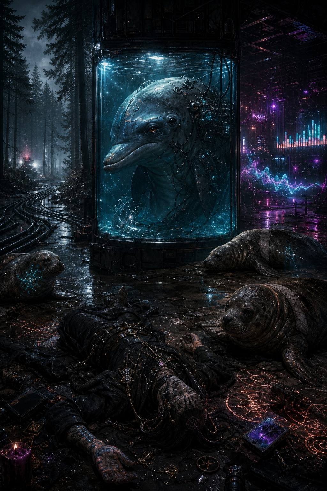

# Previously On: 612 Wharf and Core 7

## Short version

- The crew followed the tainted **Meatlets / Bebop Cola** distribution chain to **612 Wharf Avenue**, where low-level warehouse labor, surveillance drones, and magical contamination all pointed to a larger operation.
- A power-and-data line running into the woods led them to buried **Site 7**, where an entity calling itself **Core 7** was found requesting fish deliveries for "final reclamation."
- That site turned out not to be a clean AI nest but a grotesque wetware system built around a captive cybered **dolphin**, plus other exploited awakened aquatic life including **hurricane seals** and a rock-lobster-piloted combat drone.
- The runners then hit the warehouse side directly, exposing **Mother Yahweh's** counterfeit-food line and a chained **roach spirit** being carved into fake Meatlets.
- By the aftermath, the whole arc had widened again: Core 7 now appears structurally related to the older **Swiftwing / Cindy** knowbot line, **SC Music** may be sitting on top of technology history that could turn into a major scandal, and the campaign clock has now advanced through a three-day aftermath to **2066-05-04**.

## Key sessions

- [2026-04-30](../Sessions/2026-04-30.md)
- [2026-05-07](../Sessions/2026-05-07.md)
- [2026-05-14](../Sessions/2026-05-14.md)
- [2026-05-21](../Sessions/2026-05-21.md)
- [2026-05-28](../Sessions/2026-05-28.md)

## Major names

- [Mother Yahweh](../NPCs/Mother-Yahweh.md)
- [Taco](../NPCs/Taco.md)
- [Darla Ledue](../NPCs/Darla-Ledue.md)
- [SC Music](../Factions/SC-Music.md)
- [Swiftwing Records](../Organizations/Swiftwing-Records.md)

## Continuity note

This thread now clearly overlaps three previously separate-looking layers: the **counterfeit-food / insect contamination** arc, the **Darla / stolen masters / SC Music** investigation, and the older **Cindy / Swiftwing / knowbot architecture** mystery. The wiki should treat those as one intertwined continuity cluster unless later evidence cleanly separates them again.
