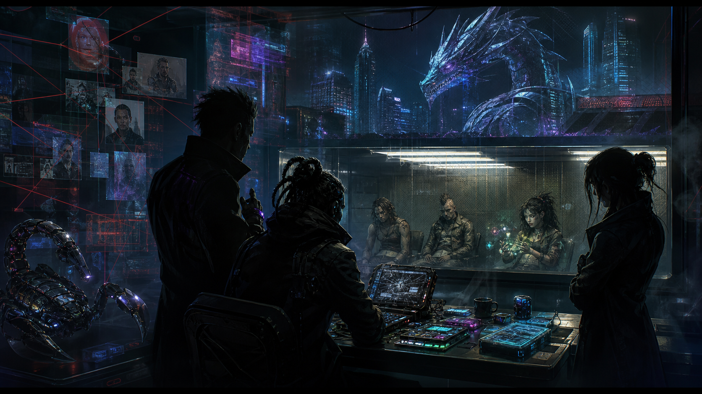

# Session 2026-08-27

## Summary

With **Valgaut** moved to a hard pause / temporary retirement, **Mevin**, **Kurgan**, and **Curtis** chose another player-driven follow-up rather than taking a prepared contract. Their target was the unanswered **Pixel Sticks** sponsor question: who gave a low-end Matrix youth gang military-grade utilities, a ruthenium-coated scorpion drone, and instructions to hit **Cross Applied Technology** interests?

The crew leaned on **Herrick** for access to the surviving Pixel Sticks prisoners now being turned into coerced gray-hat assets for Nashville PD. Herrick agreed to a mostly hands-off posture after Mevin framed the inquiry as a public-safety / containment concern, though he made clear that the city has been paid heavily to stay out of the broader **Cross Applied Technology** versus **Princeps Group** conflict.

Interviews with **Ernie Pollock**, **Ziggy Hill**, and **Lizzo Wells** confirmed the Pixel Sticks were disposable proxy assets. An anonymous Matrix benefactor contacted them, directed them to a dead drop containing the high-end utilities and a transponder, and gave them a focused task list against CAT subsidiaries. The scorpion drone appeared later at their headquarters; the gang had only enough control to identify themselves to it and keep it from killing them. A high-end draconic humanoid Matrix icon and the prior Princeps / CAT feud left **The Princeps Group** and **Claude August** strongly implicated, though not legally proven from the prisoners' testimony alone.

Lizzo Wells also clarified the **Chunky Sparkles** side of the story. She called the creature **Mr. Rainbow**, bought or obtained it as magical security after the money came through, and treated it more like a dangerous stray animal than a mission-critical sponsor asset. Mevin recognized atypical raw-data-jack details that pointed to Lizzo being an **otaku**; **Kne@zle** then identified her by the handle **Handy-Sandy** as a Grid Overwatch person of interest and told the crew to leave her in police custody.

The crew decided not to sell the lead to Princeps or kill loose ends for the dragon. Instead, Mevin packaged the information and a portion of the recovered utilities for **Imogene Viola** at CAT, presenting the crew as aligned assets rather than suspicious volunteers. Imogene confirmed CAT had been hit and that she had been the one who arranged the original Pixel Sticks contract through the shadow pipeline. She paid a modest **10,000¥** for the information and indicated CAT may contact the crew directly for future moves, cutting out **Ivan** as middleman if the relationship develops.

## Major Scenes

- The table opened by confirming **Valgaut** should be treated as hard-paused / temporarily retired for the foreseeable future rather than dragged along as an unattended active PC.
- Curtis proposed following the Pixel Sticks sponsor lead because the utilities, drone hardware, and ruthenium coating represented serious money and a serious public-safety problem.
- The crew remembered that the surviving Pixel Sticks leadership had been taken into custody by Nashville PD and were being pressured into gray-hat work.
- Mevin used etiquette and police-procedure framing to persuade **Herrick** to grant access while remaining mostly hands-off, with Herrick listening in only for city-threatening information.
- Herrick's side of the debrief confirmed an anonymous benefactor had recruited the Pixel Sticks as disposable proxy assets.
- The police files and prisoner information showed the Pixel Sticks were instructed to target **Cross Applied Technology** subsidiaries, including CAT-aligned food / retail targets.
- Curtis connected the situation to the prior **Princeps Group** / CAT proxy feud, especially the dragon power-armor incident and **Claude August's** behavior.
- Mevin took a friendly / bragging approach with **Ernie Pollock**, the brash young orc member of the cell.
- Ernie described a Matrix contact, a dead drop containing the high-end utilities and a transponder, and the later arrival of the scorpion drone inside the Pixel Sticks headquarters.
- Ernie described the benefactor's Matrix presence as a high-resolution custom draconic humanoid icon, rude and condescending enough to fit the crew's existing Princeps / Claude suspicion.
- Ernie admitted the gang was handed equipment it did not really know how to handle, overused the utilities, and did not expect further resupply.
- The crew questioned **Ziggy Hill**, the elf decker who had been jacked in during the 21st-floor breach and woke up in custody.
- Curtis opened the Ziggy interview with a whip strike meant to scare rather than maim; the intimidation itself went badly, but Ziggy still confirmed the same core account as Ernie.
- Ziggy's appearance suggested heavy headware and a low-Essence, disconnected affect; the crew did not find that he had much more sponsor information than Ernie.
- Before questioning **Lizzo Wells**, the crew decided to use concern for **Chunky Sparkles / Mr. Rainbow** as the opening angle rather than threats.
- Mevin noticed Lizzo's atypical data-jack markings and recognized a raw Matrix connection pattern like the one associated with otaku.
- Lizzo rejected the label **otaku** in favor of **technoshaman**, framing her direct Matrix connection as natural Matrix magic.
- Lizzo was pleased to hear Mr. Rainbow was safe and fed, but stayed cagey about where she got the creature.
- Lizzo said she inherited Mr. Rainbow from a friend she did not want to identify and used money from the Pixel Sticks operation to obtain magical security because she did not trust the scorpion drone.
- Kurgan planned to check Lizzo against **Kne@zle**. Kne@zle recognized the person as **Handy-Sandy**, called her a Grid Overwatch person of interest, and told the crew to leave her where she was as long as she remained safely in custody.
- The crew reviewed what they knew: the sponsor lead pointed strongly toward Princeps / Claude, Chunky Sparkles looked like Lizzo's separate security purchase, and CAT remained the best route for turning the information into value.
- Mevin used corporate-procedure and corporate-etiquette framing to approach **Imogene Viola** near **Lafayette Tower** in **Little Chiba**.
- Imogene confirmed CAT knew a Matrix group had been attacking them and that she had arranged the original Shadowrun contract to have that group removed.
- Imogene accepted the crew's information / utility handoff, paid **10,000¥**, and indicated possible future CAT work with the crew directly rather than through **Ivan**.

## NPCs / Factions Introduced or In Play

- **Ernie Pollock** - brash young orc Pixel Sticks member; confirmed the dead-drop / benefactor story and described the draconic humanoid Matrix icon.
- **Ziggy Hill** - heavily chromed elf Pixel Sticks decker; hostile after waking from the 21st-floor breach in custody, but confirmed Ernie's core story.
- **Lizzo Wells / Handy-Sandy** - Pixel Sticks-associated young woman, probable otaku / self-described technoshaman, and Grid Overwatch person of interest; called Chunky Sparkles **Mr. Rainbow**.
- **Herrick** - enabled the prisoner interviews while trying not to involve Nashville PD too deeply in the CAT / Princeps fight.
- **Kne@zle** - recognized Handy-Sandy as a Grid Overwatch person of interest and told the crew to leave her in police custody.
- **Imogene Viola** - CAT corporate-shadowrun contact; confirmed she arranged the original Pixel Sticks contract and paid the crew for the follow-up intelligence.
- **The Princeps Group** - strongly implicated as the Pixel Sticks sponsor through the CAT targeting, draconic Matrix icon, military-grade equipment, and prior proxy feud.
- **Cross Applied Technology** - confirmed target of the Pixel Sticks utility attacks and now a more direct potential patron for the crew.

## Clues Gained

- The Pixel Sticks were recruited over the Matrix by an anonymous benefactor as disposable proxy assets / stalking horses.
- The gang received its high-end utilities through a dead drop.
- The same dead drop included a transponder linked to the scorpion drone's arrival.
- The scorpion drone entered the Pixel Sticks headquarters after the fact; the gang did not fully control it.
- The gang's drone control was minimal: enough to identify themselves and avoid being killed, not enough for fine operational command.
- The sponsor's instructions focused on **Cross Applied Technology** subsidiaries and affiliates.
- The Pixel Sticks caused real harm with the utilities, including dangerous food-order or delivery manipulation, but were also careless and overused the tools.
- The benefactor used a high-resolution custom **draconic humanoid Matrix icon** and behaved in a way that reminded the crew of Claude August.
- The evidence points strongly toward **Princeps / Claude August** as the sponsor, but the crew does not yet have clean proof that would hold up beyond prisoner testimony and inference.
- Herrick knows about the CAT / Princeps feud and is deliberately avoiding it because Nashville PD has effectively been paid to stay out of that corporate conflict unless it spills directly into city business.
- **Lizzo Wells** is likely an otaku, though she rejects that label and prefers **technoshaman**.
- Lizzo calls Chunky Sparkles **Mr. Rainbow** and appears to care whether the creature is safe and fed.
- Chunky Sparkles appears to have been Lizzo's separate magical-security purchase after Pixel Sticks money came through, not necessarily part of the original sponsor package.
- **Handy-Sandy** is Lizzo Wells's Matrix handle or Grid Overwatch-relevant identity.
- Kne@zle / Grid Overwatch already knows Handy-Sandy and wants her left safely in custody.
- Imogene Viola was the CAT-side organizer behind the original Pixel Sticks takedown contract.

## Decisions Made

- The crew chose the Pixel Sticks sponsor investigation as the night's player-driven follow-up.
- The crew accepted Herrick's presence / awareness rather than trying to interview the prisoners without police visibility.
- Mevin led the soft approach with Ernie, using bragging and future-leverage incentives.
- Curtis led with hard intimidation against Ziggy, including a whip strike; after mixed results, the crew accepted that Ziggy largely confirmed Ernie's account.
- The crew approached Lizzo through concern for Chunky Sparkles rather than violence.
- Kurgan checked Lizzo / Handy-Sandy with Kne@zle and accepted the instruction to leave her in police custody.
- The crew decided not to approach Princeps directly or sell the prisoners as loose ends.
- The crew chose to approach CAT through Imogene Viola, offering useful intelligence and some recovered utilities for forensic follow-up.
- Mevin framed the CAT contact as aligned interests / joining forces, not as begging for work or making a suspicious unsolicited sales pitch.

## Rewards / Tallies

- **10,000¥ total** from Imogene Viola / Cross Applied Technology for the Pixel Sticks follow-up intelligence and utility handoff.
- With Valgaut paused, this is approximately **3,333¥ each** for Mevin, Kurgan, and Curtis, with any odd-nuyen handling not recorded.
- No Karma award was recorded in the transcript.

## Changes to Campaign State

- **Valgaut** is temporarily retired / hard-paused as an active table PC until the player returns or the GM reintroduces him.
- The **Pixel Sticks sponsor** thread now points strongly toward **The Princeps Group / Claude August**, but remains short of public or legal proof.
- CAT was confirmed as both the target of the Pixel Sticks attacks and the concealed client behind the original cleanup contract.
- The crew now has a more direct relationship with **Imogene Viola** as a CAT contact who may send future work directly.
- Nashville PD / Herrick remains deliberately hands-off on the CAT / Princeps conflict because the city has been paid not to dig into that corporate fight.
- **Lizzo Wells / Handy-Sandy** is now identified as a probable otaku / self-described technoshaman and Grid Overwatch person of interest.
- Chunky Sparkles' link to the Pixel Sticks is narrowed: it appears to have been Lizzo's personal magical-security purchase rather than the sponsor's drone package.

## Open Threads

- Can Mevin trace the draconic humanoid Matrix icon strongly enough to prove Princeps / Claude involvement?
- What will CAT do with the evidence and recovered utility samples?
- Will Imogene Viola offer the crew direct work against Princeps?
- Does Princeps know the crew has tied the Pixel Sticks operation back to them?
- Who was Lizzo's friend who supplied or transferred Chunky Sparkles / Mr. Rainbow to her?
- Why is Handy-Sandy a Grid Overwatch person of interest, and what does Kne@zle expect to happen while she remains in custody?
- How far will Herrick let the crew operate around a conflict Nashville PD has been paid to ignore?

## Updated Pages

- [Current State](../Current-State.md)
- [Session Chronology](../Timeline/Session-Chronology.md)
- [Pixel Sticks / Military-Grade Utilities Run](../Arcs/Pixel-Sticks-Utility-Run.md)
- [Pixel Sticks](../Factions/Pixel-Sticks.md)
- [Pixel Sticks 21st-Floor Cell](../NPCs/Pixel-Sticks-21st-Floor-Cell.md)
- [Lizzo Wells / Handy-Sandy](../NPCs/Lizzo-Wells-Handy-Sandy.md)
- [The Princeps Group](../Factions/The-Princeps-Group.md)
- [Claude August](../NPCs/Claude-August.md)
- [Cross Applied Technology](../Organizations/Cross-Applied-Technology.md)
- [Imogene Viola](../NPCs/Imogene-Viola.md)
- [Herrick](../NPCs/Herrick.md)
- [Grid Overwatch Division](../Organizations/Grid-Overwatch-Division.md)
- [Kne@zle](../NPCs/Kne-zle.md)
- [Mevin Kitnick](../PCs/Mevin-Kitnick.md)
- [Kurgan](../PCs/Kurgan.md)
- [Curtis](../PCs/Curtis.md)
- [Valgaut](../PCs/Valgaut.md)

## Sources

- Discord session thread 1542697848447959110
- Live transcript Session 2026-08-27
