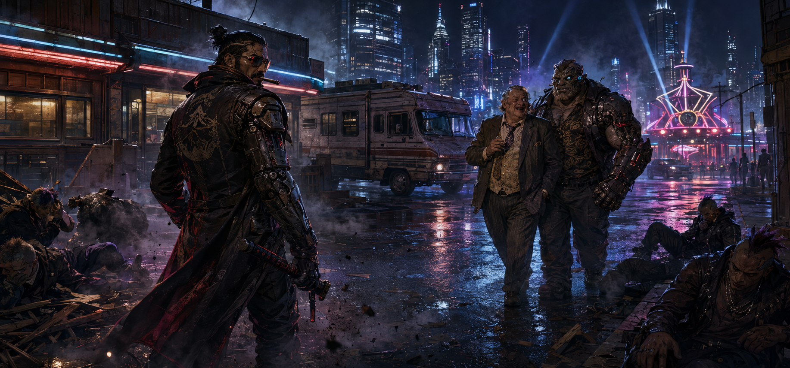

# Session 2026-09-03

## Summary

With **Valgaut** still hard-paused, Abe joined the table using **Kilimanjaro**, an alternate starter PC / generic street-samurai contact built to let new players test the campaign without committing to a bespoke long-term character. The crew chose a fresh contract instead of another player-driven loose-thread follow-up: **Byron L. Cedar**, a corporate lawyer for **HEMP Global Agronomics**, urgently hired Kilimanjaro to make sure corrupt Nashville-area circuit judge **Hiram Belisarius** could not attend court the next day, without killing him, permanently removing him from the docket, or making the move look like a clean targeted hit.

Kilimanjaro pulled in the crew through his prior working relationship with **Kurgan** and Atlas's-side familiarity with **Mevin** and **Curtis**. The group learned that Belisarius was a gambling-addicted older human judge who had already accepted payoffs from Cedar's side but had become unreliable, and that his after-hours protection came from **Renaud Dupree**, a heavily cybered Cajun troll bodyguard. The target's habits pointed toward a greasy diner near the edge of Nashville's high-security downtown and a shabby **8th Street** dice alley where Belisarius routinely lost money.

The plan shifted several times. The crew considered spiking Belisarius's food, using Kilimanjaro's jazz to push him into worse gambling choices, using Mevin's tranq patches, faking food-inspector authority, buying cheap malt liquor, taking over the judge's debt, and staging a drunken lost-night explanation. Kilimanjaro first located the judge cleanly, then scattered the 8th Street gangers with a flash grenade after they challenged him. Mevin used his cyber-ears to eavesdrop on Belisarius and Dupree, recorded their voices, and confirmed the judge owed money all over town and expected to square up with the alley crew that night. Curtis then talked Belisarius and Dupree into following the team toward a supposedly better high-roller game, with **Mucky's** gambling hall becoming the chosen destination. The session ended with the board state saved outside Mucky's: all four runners out of **Grandpa**, Belisarius and Dupree present, Mevin having talked the judge down with an etiquette success, and the final incapacitation plan still unsettled.

## Major Scenes

- The table onboarded Abe into Tabletop Simulator and introduced **Kilimanjaro** as the temporary / alternate starter PC for the night.
- The group chose a new prepared contract instead of pursuing another open loose thread.
- **Byron L. Cedar** contacted Kilimanjaro in a panic with a rush job tied to a court case involving **HEMP Global Agronomics**.
- Cedar's requirement was precise: keep **Judge Hiram Belisarius** from court tomorrow, but do not kill him or remove him from the docket long-term.
- Kilimanjaro called in the crew through **Kurgan**, having worked with him a few times around Atlas's and Nashville's shadowrunner scene.
- The table introduced the current active PCs for Abe: Mevin as a face-decker / social engineer, Kurgan as a bland cyber-samurai, and Curtis as a very short dwarf rigger with drones and a Combat Monster flaw.
- The job was set at roughly **8 p.m. on a Thursday night**, provisionally the next Thursday after the current 2066-05-15 campaign anchor.
- The offered budget was **60,000¥**, or **15,000¥ each** if split evenly, pending completion and any final negotiation.
- Kilimanjaro shared prior surveillance on Belisarius: older human, corrupt circuit judge, degenerate gambler, diner regular, and frequent visitor to a low-end alley dice game.
- The crew identified **Renaud Dupree** as Belisarius's personal security: a heavily cybered Cajun troll with dermal armor, obvious eye replacement, and reinforced or replaced arms.
- The crew discussed nonlethal ways to make Belisarius miss court while believing the failure was his own fault.
- Mevin identified tranq patches as standard carry and floated Bruce Gallstone as a possible drug source, but the short clock made immediate sourcing difficult.
- Kilimanjaro had jazz on hand and considered using it to amplify Belisarius's gambling impulse rather than directly knock him out.
- Curtis used **Grandpa** to move the team and picked up cheap malt liquor from a Stuffer Shack as part of the drunken-cover plan.
- At the diner, the team spotted Belisarius and Dupree eating together and trying poorly to appear inconspicuous.
- Mevin used his friendly-face angle to get close enough inside the diner to eavesdrop with enhanced hearing and a sound filter.
- Kilimanjaro posted near the back alley, drew the attention of **8th Street** gangers, and eventually scattered them with a flash grenade aimed to shower them with pallet splinters without killing anyone.
- The flash grenade cleared the alley but alerted Dupree, prompting Belisarius and his bodyguard to leave the diner sooner than planned.
- Kilimanjaro covered his presence with a casual "got a light" approach, received a light from Belisarius, and successfully slipped his personal comm unit onto the judge for tracking.
- Curtis used a strong etiquette play to redirect Belisarius toward a supposed higher-class gambling opportunity.
- The team debated whether to use **Mucky's** gambling hall, the old underground fighting / gambling venue, or a secluded spot; Mucky's became the active destination.
- The session stopped with Belisarius and Dupree at Mucky's, the crew facing them in an isolated approach, and no fully agreed final takedown yet.

## NPCs / Factions Introduced or In Play

- **Kilimanjaro** - Abe's alternate starter PC for the night; a generic Nashville solo / cyber-samurai who does low-risk security, surveillance, and personal-protection jobs.
- **Byron L. Cedar** - HEMP Global Agronomics corporate lawyer and Kilimanjaro's anxious client for the rush job.
- **HEMP Global Agronomics** - CAS agro-corporation specializing in genetically engineered high-yield, low-quality protein crops across the southeastern CAS / North American market.
- **Judge Hiram Belisarius** - corrupt Nashville-area circuit judge, gambling addict, and target of the night's nonlethal court-delay job.
- **Renaud Dupree** - Belisarius's heavily cybered Cajun troll bodyguard and the main immediate physical obstacle.
- **Officer Davis Holbrook** - court-assigned city security for Belisarius; keeps more distance outside work while Dupree handles after-hours protection.
- **8th Street** - minor alley crew / dice-game operators who routinely fleece Belisarius and were scattered by Kilimanjaro's flash grenade.
- **Mucky** - owner of the gambling hall chosen as the current destination for the judge lure.
- **Melchizedek** - relevant because Mucky's gambling hall is his house-domain / rigged-game territory.

## Clues Gained

- Belisarius is corrupt enough that Cedar's side expected him to stay bought, but something about the next day's case made Cedar panic.
- Cedar wants court delayed, not the judge killed, exposed, or permanently removed.
- Belisarius's vices are predictable: greasy diner food, cheap booze, gambling, and repeated trips to an 8th Street alley dice game.
- Belisarius owes money all over town and specifically expected to square up with 8th Street that night.
- Renaud Dupree is observant and protective enough to notice the alley disturbance immediately.
- Belisarius is suggestible when an opportunity flatters his belief that he is due for a hot streak.
- Kilimanjaro's comm unit is now physically on Belisarius and can potentially support tracking with Curtis's electronics help.
- Mucky's gambling hall is known enough in the shadowrunner/criminal scene to serve as a plausible high-roller lure.

## Decisions Made

- Abe used **Kilimanjaro** as a temporary starter character rather than building a long-term PC immediately.
- The crew accepted a prepared contract hook instead of pursuing the Princeps/CAT, Dead Soldier, or other player-driven loose threads that Cindy surfaced during the opening.
- Kilimanjaro offered the job as an even **15,000¥ each** split, prioritizing reputation over taking a larger originating-contact cut.
- The team aimed for a nonlethal, deniable result: make Belisarius miss court while believing he overindulged or made his own bad choices.
- Kilimanjaro chose to scatter the 8th Street gangers with a flash grenade rather than negotiate, bribe, or wait for Belisarius to play with them.
- Curtis successfully redirected Belisarius toward a fake better gambling opportunity rather than starting a fight at the diner alley.
- The group chose **Mucky's** as the next-stage destination and stopped before resolving the takedown.

## Rewards / Tallies

- **No payout recorded yet.** The job budget on the table is **60,000¥ total**, potentially **15,000¥ each** for Kilimanjaro, Kurgan, Curtis, and Mevin if completed as offered.
- **No Karma award recorded yet.**
- Kilimanjaro temporarily sacrificed / planted a personal comm unit on Belisarius as a tracking aid.
- Curtis purchased cheap malt liquor for the setup; no exact nuyen cost was recorded.

## Changes to Campaign State

- **Kilimanjaro** is now recorded as an **Alternate PC** / starter character for new players, currently used by Abe.
- A new live contract is active: **Byron Cedar / Judge Belisarius court-delay job**.
- The current active in-world date moves provisionally to **2066-05-20 evening**, the next Thursday after the prior 2066-05-15 campaign anchor; the table also joked through a minor court-next-day timing inconsistency.
- **HEMP Global Agronomics**, **Byron Cedar**, **Judge Hiram Belisarius**, **Renaud Dupree**, **Officer Davis Holbrook**, and **8th Street** enter the player-safe campaign record.
- **Mucky's gambling hall** becomes the immediate next-scene location for the ongoing job.

## Open Threads

- What case is Cedar trying to delay, and why did a bought judge become a crisis tonight?
- Can the crew incapacitate Belisarius for 24 to 48 hours without killing him or making the job look targeted?
- How will Renaud Dupree react once the trap becomes obvious?
- Will Kilimanjaro's planted comm unit remain useful or become evidence against the team?
- Will Mucky or Melchizedek tolerate the crew bringing a judge, a cybered troll bodyguard, and a messy shadowrunner problem to their gambling hall?
- Does Officer Davis Holbrook become relevant once Belisarius misses court or disappears overnight?

## Updated Pages

- [Current State](../Current-State.md)
- [Session Chronology](../Timeline/Session-Chronology.md)
- [Byron Cedar / Judge Belisarius Rush Job](../Arcs/Byron-Cedar-Judge-Belisarius-Rush-Job.md)
- [Kilimanjaro](../PCs/Kilimanjaro.md)
- [Mevin Kitnick](../PCs/Mevin-Kitnick.md)
- [Kurgan](../PCs/Kurgan.md)
- [Curtis](../PCs/Curtis.md)
- [Byron L. Cedar](../NPCs/Byron-Cedar.md)
- [Judge Hiram Belisarius](../NPCs/Judge-Hiram-Belisarius.md)
- [Renaud Dupree](../NPCs/Renaud-Dupree.md)
- [Officer Davis Holbrook](../NPCs/Officer-Davis-Holbrook.md)
- [HEMP Global Agronomics](../Organizations/HEMP-Global-Agronomics.md)
- [8th Street](../Factions/8th-Street.md)
- [Mucky's place](../Locations/Muckys-Place.md)
- [Memphis Menthol Mephistopheles Muckmeyer](../NPCs/Mucky.md)
- [Melchizedek](../NPCs/Melchizedek.md)

## Sources

- Discord session thread 1545232212272881694
- Live transcript Session 2026-09-03
