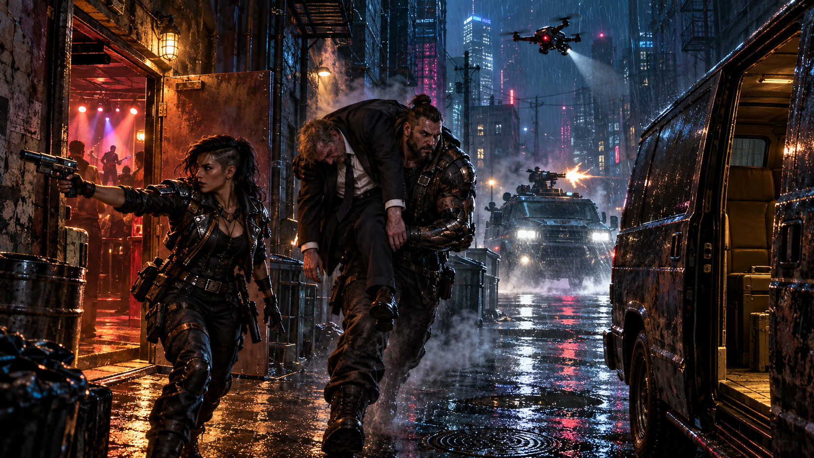

# Session 2026-09-10

## Summary

**Curtis, Mevin, and Kilimanjaro completed the Byron Cedar / Judge Belisarius court-delay job.** Kurgan withdrew from the scene to avoid compromising his City Hall connections, leaving the three runners to finish the lure outside **Mucky's Place**. Curtis sold the judge on a gambling advantage using his cyber-eye and Cindy Lou's analysis; Mevin secured Mucky's knowing cooperation for a cut of the job. With the judge winning, drinking heavily, and increasingly off guard, Mucky's troll bouncer distracted Renaud Dupree just long enough for Mevin to apply a tranq patch and Kilimanjaro to carry Belisarius out the back.

The intended discreet extraction became an armed pursuit. The Finisher failed to disable Dupree's tires, and the bodyguard gave chase in an armored vehicle with a pop-up machine gun. Curtis rigged Grandpa through a sharp turn while The Finisher covered the escape. Kilimanjaro fired a grenade into the pursuer's engine compartment, causing a crash that **Dupree survived**.

Mevin secured the unconscious judge and worked with Cindy on the cyber-eye signal, then reframed the incident as a gambling-debt shakedown. Curtis found an out-of-the-way holding place; the crew kept Belisarius out of court through the next day and released him alive near **8th Street Cafe**, staged as a beaten, drunken debtor rather than a corporate assassination target. The kidnapping made the news, but **Cedar accepted the result surprisingly happily and paid**. The reason his supposedly discreet job could end this publicly without upsetting him remains an explicit mystery. **All PCs received 5 Karma; Curtis and Mevin received 20,000¥ each.**

## Major Scenes

- **Resume at Mucky's:** Kurgan stepped away to preserve plausible deniability around his City Hall / retirement ambitions. Valgaut remained hard-paused; Abe continued as alternate starter PC Kilimanjaro.
- **Sell the winning streak:** Curtis persuaded Belisarius to accept outside gambling advice. The judge paired his cyber-eye through Grandpa so Cindy could read the feed and send suggestions. The arrangement was a specific accepted connection, not unrestricted access to every system nearby.
- **A second signal:** The cyber-eye also emitted a local signal. Mevin considered the risk of recorded evidence; later assessment favored Dupree using it as a tracking / live-view aid. No remote archive or permanent recording was confirmed.
- **Enter the club:** Dupree got the group through the entrance. **Joe Jack and the Heart Attack**, Mucky's house band, played on stage beside the gambling and seating areas.
- **Make a deal with the house:** Mevin approached **Mucky**, who valued Belisarius as a useful corrupt judge and agreed to help for **10% of the take**. Curtis coordinated a distraction around the judge's unusual winning streak. Mucky wanted the judge available again after the missed court day.
- **Cards and confidence:** Kilimanjaro stayed close by joining the card game and lost several hundred nuyen. Cindy's guidance kept Belisarius ahead despite bad play and heavy drinking. Kilimanjaro recognized how secure the judge felt: debts and embarrassment were tolerable because powerful people needed his services.
- **The doorway opening:** Mucky sent troll bouncer **Big Lou / Big Blue** to draw Dupree away. Dupree only moved to the other side of a doorway, so the crew used the rear exit. The house band's van narrowed the alley and limited Grandpa's positioning.
- **Extract the judge:** Mevin applied a tranq patch to the already intoxicated Belisarius. Kilimanjaro carried him out before Dupree could intervene, and the crew loaded him into Grandpa. Some patrons plainly noticed something was happening.
- **Finisher's failed tire shot:** Curtis launched The Finisher and tried to disable Dupree's vehicle without destroying it. The shot failed; the reinforced armor resisted the SMG fire. Dupree deployed a pop-up machine gun, missed the drone, and pursued.
- **Vehicle chase:** Curtis took direct control of Grandpa and made a sudden turn while The Finisher operated on its Pilot 2 and fired on the pursuer. Its rounds caused limited damage. Kilimanjaro then used the Ares Alpha's underslung grenade launcher to hit the engine compartment; Dupree lost control and crashed. His survival was later explicitly confirmed.
- **Secure the feed:** Mevin found Kilimanjaro's planted comm unit, blocked the judge's cyber-eye view, and used Curtis's tools to locate the transmitter and a hardware switch. Rather than rely only on shutting it off, he asked Cindy to support a false trail; the GM accepted her successful signal-spoofing capability.
- **Build the debt-collection cover:** Mevin proposed making the abduction look like a gambling-debt shakedown. Kilimanjaro contributed security planning and Curtis found a secluded holding place. The crew kept Belisarius incapacitated through court, staged injuries and drunkenness, and released him near 8th Street Cafe after court closed. The GM resolved the drop-off successfully.
- **Close and pay:** Cedar confirmed the job was done and responded unexpectedly positively despite the public abduction. Kilimanjaro volunteered his share to cover Mucky's assistance so Curtis and Mevin could each retain **20,000¥**. The GM awarded **5 Karma** and saved the board.

## NPCs / Factions Introduced or In Play

- **[Byron L. Cedar](../NPCs/Byron-Cedar.md)** / **[HEMP Global Agronomics](../Organizations/HEMP-Global-Agronomics.md)** - employer side; accepted and paid for the completed court delay, with motives still unclear.
- **[Judge Hiram Belisarius](../NPCs/Judge-Hiram-Belisarius.md)** - kidnapped, held through court, and released alive under the staged debt-collection story.
- **[Renaud Dupree](../NPCs/Renaud-Dupree.md)** - bodyguard and likely cyber-eye tracking recipient; pursued in an armed armored vehicle and survived the crash.
- **[Mucky](../NPCs/Mucky.md)** - knowing facilitator who supplied alcohol and a distraction for a share of the take.
- **[Big Lou / Big Blue](../NPCs/Big-Lou.md)** - Mucky's troll bouncer. Both names appear in the transcript; spelling remains provisional.
- **[Joe Jack and the Heart Attack](../Organizations/Joe-Jack-and-the-Heart-Attack.md)** - newly recorded house band; its van occupied part of the extraction alley.
- **[Cindy Lou Jenkins](../NPCs/Cindy-Lou-Jenkins.md)** - gambling analysis, cyber-eye feed support, and signal spoofing for the cover story.
- **[8th Street](../Factions/8th-Street.md)** - neighborhood/debt association used in the cover; not the actual kidnappers.
- **[Officer Davis Holbrook](../NPCs/Officer-Davis-Holbrook.md)** - court-security context only; no intervention this session was established.

## Clues Gained

- Belisarius's corruption makes him useful to underworld figures, including Mucky; his confidence rests on that protection, not on sound judgment.
- The cyber-eye's extra signal was local. Dupree was the most plausible recipient, but persistent recording and offsite storage were not established.
- Dupree's vehicle was reinforced and armored, with a pop-up machine gun. Its make/model and later disposition remain unconfirmed.
- The abduction generated a missing-person news story; the crew did not leave a wholly invisible operation.
- **Cedar's surprisingly positive reaction is the major new unresolved clue.** The GM explicitly indicated there was something to investigate behind it.

## Decisions Made

- Finish the job with Curtis, Mevin, and Kilimanjaro while Kurgan protected his City Hall-facing identity.
- Work with Mucky rather than assume the house would unknowingly host the con.
- Use the judge's willing cyber-eye connection to feed him gambling advice and keep him engaged.
- Extract through the back when the bodyguard distraction proved shallower than hoped.
- Disable the pursuer with escalating vehicle fire rather than abandon the judge; Dupree's death was not the resolved outcome.
- Recast the conspicuous kidnapping as a debt shakedown and hold Belisarius only through the required court day before release.
- Let Kilimanjaro cover Mucky's assistance from his own share, preserving Curtis's and Mevin's confirmed payouts.

## Rewards / Tallies

- **5 Karma to all player characters**, explicitly confirmed by the GM on 2026-09-11: Curtis, Mevin, Kurgan, Valgaut, and alternate PC Kilimanjaro. This does not imply that absent or paused PCs attended.
- **Curtis: +20,000¥**, taking tracked nuyen **6,503.33¥ -> 26,503.33¥** and Karma **14 -> 19**. Existing project-cost caveats and unpriced incidental expenses remain.
- **Mevin: +20,000¥**, taking the partially reconstructed tracked nuyen subtotal **24,333¥ -> 44,333¥** and Karma subtotal **11 -> 16**. These are not newly reconstructed complete personal balances.
- **Kurgan: +5 Karma**, tracked subtotal **22 -> 27**; no nuyen award assigned.
- **Valgaut: +5 Karma**, **14 -> 19**, remaining hard-paused; no nuyen award assigned.
- **Kilimanjaro: +5 Karma**, first explicit award tracked on his page. He volunteered his share to cover Mucky's cut; his precise retained net payout was not stated. Do not invent a final personal balance or subtract Mucky's fee again from Curtis or Mevin.
- **Contract budget: 60,000¥.** Mucky requested **10%**. The earlier four-way 15,000¥ proposal is superseded by the explicit closing payouts, not added to them.
- Kilimanjaro lost **several hundred nuyen** at cards and fired **one high-explosive grenade**. Mevin used a tranq patch; offered credstick / alcohol expenses were not priced. No exact expense or ammunition restock cost is invented.
- Mevin located Kilimanjaro's planted comm unit; an explicit return to its owner's inventory was not narrated.
- No new damage to Grandpa or The Finisher was confirmed. Dupree's crashed vehicle was not recovered as crew loot.
- In-session Karma Pool use is not treated as an advancement-Karma expenditure.

## Changes to Campaign State

- The **Byron Cedar / Judge Belisarius contract is complete and paid**, not paused at Mucky's.
- Belisarius survived and missed the required court day; Dupree also survived.
- Mucky was a knowing paid participant, not an unsuspecting target of the crew's con.
- The current scene advances through the next day to **after court closed**, provisionally **2066-05-21 evening** from the prior **2066-05-20 evening** anchor. The next-day advance is explicit; the absolute calendar date remains provisional.
- No exact in-world stop time was stated. The crew is between runs; no next mission was selected.
- New durable records: Big Lou / Big Blue, Joe Jack and the Heart Attack, and 8th Street Cafe.
- Kilimanjaro remains an alternate starter PC. Continuing him or building a different character for Abe was discussed, not decided.

## Open Threads

- What case did Cedar need delayed, and why did the obvious kidnapping still satisfy him so well?
- Will Dupree identify or retaliate against the crew after his crash?
- Will the debt-shakedown story withstand the missing-person publicity, witnesses, or court-security attention?
- Will 8th Street react to a story that points toward its gambling neighborhood?
- What is Kilimanjaro's exact net payout after covering Mucky and his card losses? Only Curtis's and Mevin's final cash awards were explicitly fixed.
- Will Abe retain Kilimanjaro or introduce a bespoke PC?

## Updated Pages

### Archive and campaign navigation

- [Front Page](../index.md)
- [Current State](../Current-State.md)
- [Session Archive](README.md)
- [Session Chronology](../Timeline/Session-Chronology.md)
- [Campaign Timeline](../Timeline/index.md)
- [Campaign Arc Index](../Timeline/Arc-Index.md)
- [Lead Board](../Clues/README.md)
- [Byron Cedar / Judge Belisarius Rush Job](../Arcs/Byron-Cedar-Judge-Belisarius-Rush-Job.md)

### Characters and rewards

- [Curtis](../PCs/Curtis.md)
- [Mevin Kitnick](../PCs/Mevin-Kitnick.md)
- [Kurgan](../PCs/Kurgan.md)
- [Valgaut](../PCs/Valgaut.md)
- [Kilimanjaro](../PCs/Kilimanjaro.md)
- [Cindy Lou Jenkins](../NPCs/Cindy-Lou-Jenkins.md)
- [Byron L. Cedar](../NPCs/Byron-Cedar.md)
- [Judge Hiram Belisarius](../NPCs/Judge-Hiram-Belisarius.md)
- [Renaud Dupree](../NPCs/Renaud-Dupree.md)
- [Mucky](../NPCs/Mucky.md)
- [Melchizedek](../NPCs/Melchizedek.md)
- [Officer Davis Holbrook](../NPCs/Officer-Davis-Holbrook.md)
- [Big Lou / Big Blue](../NPCs/Big-Lou.md) - new
- [NPC Index](../NPCs/README.md)

### Places, organizations, and vehicles

- [Mucky's Place](../Locations/Muckys-Place.md)
- [8th Street Cafe](../Locations/8th-Street-Cafe.md) - new
- [Location Index](../Locations/README.md)
- [Joe Jack and the Heart Attack](../Organizations/Joe-Jack-and-the-Heart-Attack.md) - new
- [HEMP Global Agronomics](../Organizations/HEMP-Global-Agronomics.md)
- [Organization Index](../Organizations/README.md)
- [8th Street](../Factions/8th-Street.md)
- [Grandpa](../Locations/Grandpa.md)
- [The Finisher](../Vehicles/The-Finisher.md)

## Sources

- [Discord: Session 2026-09-10](https://discord.com/channels/430878850319253504/1547766816871415818), under the Shadowrun channel; live transcript archive `2026-09-10T20-32-45-shadowrun`.
- **Scope:** gameplay begins around **8:10 p.m. Central** and closes around **10:00 p.m. Central**, with the final rewards/debrief extending to roughly **10:05-10:08 p.m.** The local capture clock is one hour ahead of Central daylight time: the gameplay recap begins at 21:10, job completion at 23:03, payout at 23:04, Karma at 23:05, and session archival at 23:08. Earlier setup/pregame conversation is excluded from campaign canon.
- **Targeted transcript evidence, host-local times:** 21:11 Kurgan withdrawal; 21:37 cyber-eye pairing; 21:45 house band; 21:51-21:55 Mucky/bouncer/agreement; 22:13-22:18 feed interpretation and judge's protected status; 22:22-22:30 distraction/extraction; 22:31-22:51 vehicle chase; 22:52-22:58 feed security and shakedown cover; 23:00 Dupree survival; 23:01-23:03 holding/release and successful completion; 23:04-23:05 final rewards.
- GM closeout instruction dated **2026-09-11** confirms **all PCs +5 Karma**, **Curtis +20,000¥**, and **Mevin +20,000¥**.
- [Session 2026-09-03](2026-09-03.md) supplies the prior scene and provisional calendar anchor. Transcript slips such as calling Belisarius the mayor are normalized to the established judge identity; game-mechanics table explanations are not promoted into new SR3 rules or permanent stat changes.
