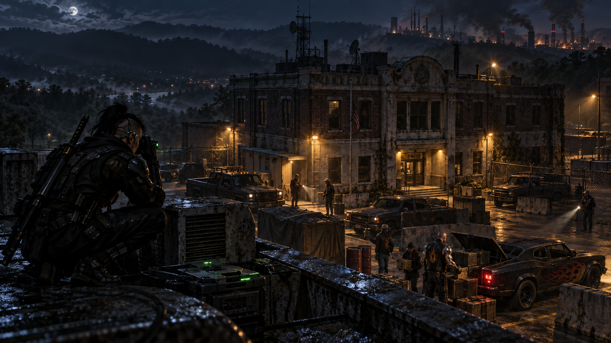

# Session 2026-09-17

## Summary

**Curtis, Mevin, and Kilimanjaro began a new physical-evidence retrieval job against a Humanis-affiliated smuggling site north of Nashville.** An anonymous Mr. Johnson hired them to recover pre-Crash paper records and physical evidence from an old White Creek police station / town hall that once handled Return-of-Magic refugee processing. The desired evidence concerns **Lula Bell Sandusky**, a late-60s moral crusader and commentator currently calling for inquiries into Mayor Haggar's rumored metahuman status.

The building is now occupied by **Paul Hardcastle** and the **Ring of Fire**, a Humanis-affiliated smuggling gang whose members are called Torchmen. Their old civic-center stronghold sits in a ruined hill-country town north of the city, with reinforced transports, patched old police cars, makeshift barricades, guard posts, and a low-tech security posture. The crew learned the site is less a wired corporate facility and more an armed way station keeping a border route open for Humanis-aligned business.

The runners performed initial surveillance instead of rushing the building. Curtis put Buzz on the roof; Kilimanjaro infiltrated close enough to reach the roof himself, identify entry points, confirm a roof hatch maglock, and hide Buzz in dead roofing equipment for a several-day passive listen. Mevin and Cindy Lou found evidence consistent with an intermittent Matrix connection to the site. The crew then returned to Nashville, bought improvised smoke/flash gear and extra gas masks, and stopped at a natural pause before Mevin's planned Humanis-host / Matrix approach. **No final award or payout was recorded yet.**

## Major Scenes

- **Job offer:** An anonymous Mr. Johnson presented a data retrieval job where the "data" is old-fashioned paper and physical evidence, not files to download. The handoff will need to happen inside Nashville via burner contact once the crew has the material.
- **Target identity:** The requested evidence concerns **Lula Bell Sandusky**, an older public moral crusader whose anti-metahuman / anti-Haggar commentary has become politically inconvenient.
- **White Creek context:** The target site is an old police station / civic center in **White Creek**, north of Nashville. It once helped funnel refugees into the city during the early Return-of-Magic / Crash-era panic, and much of the rusted checkpoint infrastructure remains.
- **Occupiers identified:** The facility is held by **Paul Hardcastle** and the **Ring of Fire**, a Humanis-affiliated smuggling gang. The Johnson estimated at least 20 men operate out of the building, though not all may be present at once.
- **Humanis read:** Kilimanjaro caught that Sandusky may be ideologically closer to Humanis than Mevin first assumed, since her current public line attacks rumored metahuman or dragon influence.
- **Pre-Crash prep:** Mevin tried to source old-compatible hardware. Cindy helped point him to a thrift-store find: a primitive palm-pilot-like device with a 9-pin connector that might pull data from an old terminal if one exists on site.
- **Approach north:** Grandpa carried Curtis, Mevin, and Kilimanjaro out past Nashville's border. City drone/radio noise faded rapidly once they left the urban zone.
- **Drone overview:** Curtis sent up Buzz for a high-altitude pass. He found White Creek's old civic block, the two-story building, a fenced/reinforced parking lot, vehicles, and a fortified low-tech setup.
- **Ground infiltration:** Kilimanjaro approached on foot, used athletics and stealth to get close, and mapped visible access: front door, side / maintenance or loading door, roof access, and possible window escape routes.
- **Low-tech security:** The crew found no local drone/radio security, no visible roof cameras, and no satellite dish. The operation appears deliberately low-tech, with people and old vehicles doing most of the work.
- **Roof surveillance:** Curtis piloted Buzz low onto the roof. The drone heard activity on the second floor but could not clearly penetrate the roof/ducting. Food smoke from a vent confirmed someone was cooking inside.
- **Kilimanjaro on the roof:** Kilimanjaro scaled the building, smelled the grim bean-cooking vent, listened through it, and heard bored male voices complaining about food and patrol work.
- **Roof hatch:** Kilimanjaro found a back roof hatch secured with a maglock. Mevin has maglock skills, making it a possible future entry point.
- **Hardcastle sighting:** A souped-up hot rod arrived and **Paul Hardcastle** stepped out with supplies. Kilimanjaro recognized him from the Johnson's description.
- **Distraction planning:** The crew discussed spoofing a call from Hardcastle or otherwise luring many Torchmen away on a fake job, rather than fighting the whole site at once.
- **Buzz planted:** Kilimanjaro hid Buzz inside a rusted, nonfunctional roofing-equipment panel near useful pipes. Curtis expects it can listen passively for several days before needing recharge.
- **Supply day:** The team returned to Nashville. Kilimanjaro bought **three flash improvised bombs and three smoke improvised bombs** for **2,000¥**. Curtis recovered four cyber-disks / disc mines, bought **six smoke improvised bombs** for **2,000¥**, and added **two gas masks** for **500¥**, giving the active crew three masks total.
- **Matrix lead:** Cindy / CLJ found a disappearing signal consistent with an intermittent Matrix connection tied to the location. Mevin was pointed toward a **Humanis Nashville Hidden Host** approach, but the table stopped before running it.

## NPCs / Factions Introduced or In Play

- **[Paul Hardcastle](../NPCs/Paul-Hardcastle.md)** - Humanis-linked Ring of Fire leader operating from White Creek; cybered, chromed, and seen bringing supplies in from a hot rod.
- **[Lula Bell Sandusky](../NPCs/Lula-Bell-Sandusky.md)** - public moral crusader and commentator; the job seeks old incriminating evidence from her youth.
- **[Ring of Fire](../Factions/Ring-of-Fire.md)** - Humanis-affiliated smuggling gang; members are called Torchmen.
- **[Humanis](../Factions/Humanis.md)** - ideological / organizational umbrella linked to the Ring of Fire and to Kurgan's past.
- **[White Creek Civic Center](../Locations/White-Creek-Civic-Center.md)** - old police station / town hall now used as the gang's fortified base.
- **[Cindy Lou Jenkins](../NPCs/Cindy-Lou-Jenkins.md)** - helped source retro hardware and later detected the intermittent Matrix signal.
- **[Buzz](../Vehicles/Buzz.md)** - Curtis's surveillance drone; hidden on the roof as a passive listening asset.

## Clues Gained

- Lula Bell Sandusky has an old arrest/investigation record from roughly forty years ago, likely from her teenage years during the Return-of-Magic / Crash-era chaos.
- The desired material is probably a filing-cabinet-drawer scale of papers plus unknown physical evidence; the site catalog may be on location.
- The Ring of Fire may not know the material's value. The Johnson had no evidence that anyone already approached them for it.
- White Creek was once a refugee-processing point for people fleeing rural chaos into Nashville. Humanis preserves some of that checkpoint infrastructure as ideological nostalgia as much as security.
- The Ring of Fire is not simply a Humanis office. It is a smuggling / import-export gang that works for or around Humanis interests, patrols routes, bribes or manages border guards, and keeps a way station open.
- The building has people on the second floor, at least two guard posts, patched old police cars, reinforced transports, and some working power.
- The security posture is deliberately low-tech: no visible cameras, no detected drones/radio security, and no satellite dish.
- There is some kind of intermittent Matrix connection associated with the location, but its path and host details remain unresolved.
- Paul Hardcastle physically visits the site and may provide an exploitable voice / command-pattern lead if Buzz records enough audio.

## Decisions Made

- Accept the retrieval job and treat it as physical evidence movement, not a quick Matrix theft.
- Source old-interface hardware before entering the pre-Crash site.
- Recon first with Grandpa, Buzz, and Kilimanjaro instead of attacking the fortified site.
- Preserve Buzz on the roof as a passive recorder for several days rather than pulling it back immediately.
- Explore a distraction or spoofed job-call plan to reduce the number of Torchmen on site.
- Return to Nashville for supplies before the breach.
- Pause before Mevin's Humanis-host / Matrix attempt so Kurgan can potentially join the continuation.

## Rewards / Tallies

- **No final Karma award, job payout, or completion reward was recorded.**
- Kilimanjaro bought **three flash improvised bombs and three smoke improvised bombs** for **2,000¥**.
- Curtis bought **six smoke improvised bombs** for **2,000¥** and **two additional gas masks** for **500¥**. With existing gear, the active crew has three gas masks available.
- Curtis recovered / staged **four cyber-disks / disc mines** previously associated with the scorpion-drone recovery.
- A hand truck / rolling luggage was discussed for moving evidence, but no specific cost was recorded.
- Buzz is deployed on the White Creek roof as an active unattended surveillance asset; no loss or damage was recorded.

## Changes to Campaign State

- The active table scene is no longer between runs: a new Humanis / Ring of Fire physical-evidence retrieval job is underway.
- The current in-world date is **provisional late May 2066**, after the Belisarius job. At least two in-world days of legwork pass during this session after the Johnson meet: one day for Mevin's retro-hardware sourcing / initial reconnaissance and another day for supply runs and Matrix prep.
- The crew has an unresolved passive-surveillance asset in place and a likely next-step Matrix approach via the Humanis Nashville hidden host.
- Kurgan was absent, but the GM noted the run was originally written with Kurgan's Humanis history in mind; Curtis explicitly wanted to continue the Matrix/action phase with Kurgan present.

## Open Threads

- Who hired the crew to retrieve Lula Bell Sandusky's old evidence, and what do they intend to do with it?
- What exactly did Sandusky do as a young woman, and why is the evidence still politically useful now?
- Does Sandusky's anti-metahuman / anti-Haggar campaign connect directly to Humanis, or only overlap ideologically?
- What is on the intermittent Matrix connection, and can Mevin use it to spoof orders or draw Torchmen away?
- Can Buzz capture enough of Paul Hardcastle's voice for a spoofing plan?
- How many Ring of Fire members will be present when the crew returns, and can the runners reduce that number before entering?
- Will Kurgan's former Humanis association create an advantage, complication, or both?

## Updated Pages

- [Front Page](../index.md)
- [Current State](../Current-State.md)
- [Session Archive](README.md)
- [Session Chronology](../Timeline/Session-Chronology.md)
- [Campaign Arc Index](../Timeline/Arc-Index.md)
- [Lead Board](../Clues/README.md)
- [Humanis Evidence Retrieval](../Arcs/Humanis-Evidence-Retrieval.md)
- [White Creek Civic Center](../Locations/White-Creek-Civic-Center.md)
- [Paul Hardcastle](../NPCs/Paul-Hardcastle.md)
- [Lula Bell Sandusky](../NPCs/Lula-Bell-Sandusky.md)
- [Ring of Fire](../Factions/Ring-of-Fire.md)
- [Humanis](../Factions/Humanis.md)
- [Curtis](../PCs/Curtis.md)
- [Mevin Kitnick](../PCs/Mevin-Kitnick.md)
- [Kilimanjaro](../PCs/Kilimanjaro.md)
- [Kurgan](../PCs/Kurgan.md)
- [Cindy Lou Jenkins](../NPCs/Cindy-Lou-Jenkins.md)
- [Buzz](../Vehicles/Buzz.md)

## Sources

- [Discord: Session 2026-09-17](https://discord.com/channels/430878850319253504/1550307363314213044), under the Shadowrun channel; live transcript archive `2026-09-17T20-47-59-shadowrun`.
- **Scope:** gameplay begins around **8:10 p.m. Central** after setup chatter and closes at roughly **9:50-9:51 p.m. Central**. The host-local capture clock is Eastern time: the Johnson brief begins around 21:10 EDT; closeout / session end occurs at 22:51 EDT.
- **Targeted transcript evidence, host-local times:** 21:10-21:24 Johnson brief, Lula Bell Sandusky, Paul Hardcastle, Ring of Fire, evidence size; 21:28-21:29 Cindy-sourced old hardware; 21:31-21:47 route north, White Creek, drone pass, Kilimanjaro infiltration, low-tech security; 21:52-22:17 Buzz on roof, roof access, cooking vent, roof hatch; 22:17-22:31 distraction planning and Hardcastle sighting; 22:32-22:38 Buzz planted, site Matrix clues; 22:39-22:45 supply purchases; 22:46-22:49 pause before Humanis host / Matrix approach.
