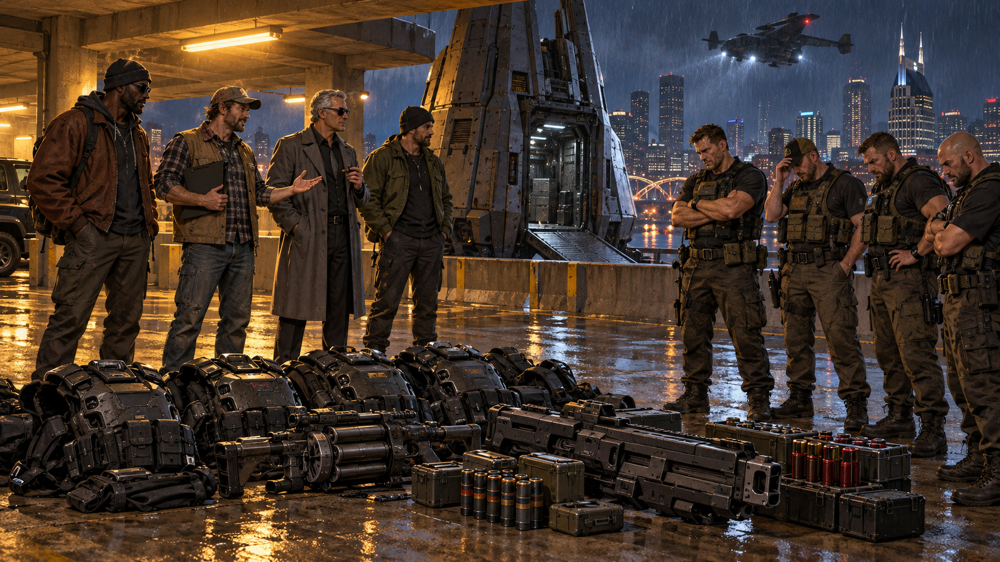

# Session 2026-10-08

## Summary

**The crew made it back into Nashville with the White Creek material, confirmed that the Sandusky files contain politically damaging evidence, and acquired heavy security gear during an unexpected downtown drop-pod encounter. The Humanis evidence-retrieval run remains open: the crew has not decided what to do with the compromising material or completed a handoff.**

On the drive into town, Kurgan checked with **Joseph Neumann**, who said the mayor's office had not hired the crew but would pay **55,000¥** to take the Sandusky material into the mayor's private custody. The GM recalled the original contract's quoted payment as **60,000¥ total**. Kurgan left Neumann's offer open rather than accepting it. The team discussed making or dividing copies among the original Johnson, the mayor's office, and themselves; they chose to defer that decision until the next session.

Kurgan also called his old contact **Glenn** about the powerful tainted spirit seen over White Creek. Glenn projected to investigate; after the spirit vanished amid flashes of light, Glenn returned to say the Hidden Enforcers had banished it. The summoner concealed its presence and appears to be a powerful practitioner. The follow-up Glenn expects from Kurgan remains unresolved.

Near downtown, a military-grade drone dropped a large pod into a parking structure beside City Hall. The pod and a prototype weapon were recognized as Princeps-style / CAS military knockoffs with identifying marks removed, but their owner and mission were not established. The crew avoided a fight with four armed occupants, used a disguise-and-bluff approach, and came away with four sets of heavy security armor, a prototype shotgun/assault cannon, a grenade launcher, and ammunition. Exact weapon identification, statistics, and individual allocation remain to be checked.

The GM placed the session at approximately **8:00-10:05 p.m. Central**. The in-world scene continues on the same provisional late-May-2066-or-later night as the preceding White Creek sessions.

## Major Scenes

- **Back to Nashville with the evidence:** The crew began moments after leaving White Creek, driving with the Sandusky records and extra material aboard. The files include photographs, VHS tapes, typed and witness reports, and DNA evidence. They establish that Lula Bell Sandusky was involved in early Humanis violence against refugee groups during the collapse around the Virus and return of magic; the material could destroy her clean public reputation and give its holder leverage.
- **Kurgan's call to Joseph Neumann:** Neumann denied that the mayor's office had put out the original job, but was eager to secure the material for Mayor Haggar. The GM recalled the original contract's quoted payment as **60,000¥ total**. Neumann offered **50,000¥**, raised to **55,000¥** after Kurgan negotiated. The buyout offer was not accepted. No original-Johnson contact, handoff, or payout occurred. The crew debated holding copies and dividing or selectively sharing the evidence, but deferred its choice.
- **Glenn and the tainted spirit:** Kurgan asked Glenn, now with the Hidden Enforcers, to investigate the hostile spirit. Glenn went out of contact while projecting. The spirit blinked out amid flashes; Glenn later reported that the Hidden Enforcers had banished it and that its summoner was powerful enough to mask their presence. Glenn expects Kurgan to answer for the response/resources called in; no terms or cost were settled.
- **Drop pod beside City Hall:** A heavy military drone carrying a large pod kept pace with the crew before releasing it toward a nearby parking structure. The pod's design was recognized as a CAS military platform and the drone as a Princeps-style knockoff; identifying marks had been removed. Four armed people emerged: one with a grenade launcher, one with a flamethrower, one with a shotgun, and one with a heavy belt-fed weapon. Kurgan and Kilimanjaro followed them and overheard their anger that they were not being paid enough and their request for pickup.
- **A bluff instead of a firefight:** The crew gathered four makeshift disguises, arranged a car, and persuaded the armed group to change clothes and leave its gear. The GM confirmed the crew acquired four sets of heavy security armor, a prototype shotgun/assault cannon, a grenade launcher, and ammunition. The crew left the area; exact weapon stats and who keeps each item remain for later bookkeeping.

## NPCs Introduced / In Play

- **Joseph Neumann** — confirmed that Mayor Haggar's office did not commission the evidence-retrieval job. He offered 55,000¥ for the mayor to take private custody of the Sandusky material; Kurgan did not accept or reject the offer.
- **Glenn** — Kurgan's longtime magical contact and Hidden Enforcer. He projected to investigate the tainted spirit, then reported its banishment by Hidden Enforcer resources. He expects a follow-up from Kurgan.
- **Four unidentified pod occupants** — armed personnel who left in disguise after surrendering their armor and weapons. Names, employer, and connection to the drone/pod are unknown.
- **Mayor Mike Haggar** — not directly present; his office's interest in controlling Sandusky's history was conveyed through Neumann.
- **Lula Bell Sandusky** — the recovered material now establishes a direct record of her youth in violent proto-Humanis activity. Its public release and political consequences have not occurred.

## Clues Gained

- The recovered physical files include photographs, VHS tapes, typed reports, witness reports, and DNA evidence documenting Sandusky's early involvement in violence against refugee groups. Their evidentiary value in current law or politics remains to be determined.
- Joseph Neumann's offer indicates that Mayor Haggar's office wants private control of the material, despite not having hired the crew. The original Johnson's identity and intended use remain unknown.
- The tainted spirit was banished by a substantial Hidden Enforcers response. Its summoner was powerful and had concealed their presence; neither identity nor affiliation was revealed.
- A Princeps-style knockoff drone delivered a stripped-marking CAS military pod near City Hall. The four occupants' employer, target, and intended purpose are unknown.
- The occupants complained that they were not being paid enough and wanted pickup. Their claim does not establish who hired them or who supplied their gear.

## Decisions Made

- Kurgan contacted Joseph Neumann rather than immediately calling the original Johnson; he left Neumann's 55,000¥ offer pending.
- Kurgan called Glenn for magical help. The crew continued toward downtown while Glenn projected, and Kurgan agreed to follow up with Glenn about the Hidden Enforcers' response.
- The crew chose a disguise/bluff to resolve the pod-occupant encounter without combat.
- The crew deferred the decision about what to do with the compromising evidence until next session. The run continues.

## Rewards / Ledgers

- **Acquired gear only:** four sets of heavy security armor; a prototype shotgun/assault cannon (the transcript uses both descriptions); a grenade launcher; and ammunition for the acquired weapons. Exact model/stat blocks, final custody, and individual allocation are not yet established.
- **No Karma award, nuyen payout, or job-completion award.** Neumann's 55,000¥ offer remains unaccepted; the original Johnson has not been paid or handed the material.
- No damage, ammunition expenditure, or other balance change was confirmed in the closeout record.

## Changes to Campaign State

- The crew is back in Nashville and has moved on from the burning White Creek site with the evidence. The Sandusky cache's central compromising content is now known, but the additional paydata and terminal remain unreviewed.
- The mayor's office is a possible buyer/holder, not the confirmed original client. The crew has not agreed to an exclusive sale, copy arrangement, or division of the material.
- The tainted spirit is no longer present after the Hidden Enforcers' intervention; the summoner remains unidentified and Glenn's requested follow-up is pending.
- The crew obtained military-grade armor and weapons through the pod encounter. Weapon statistics and individual inventory records remain unconfirmed.
- The in-world date remains provisional and carries forward from the prior session; no exact date or meaningful calendar advance was stated.

## Open Threads

- Decide whether to accept, reject, or counter Neumann's **55,000¥** offer; determine whether to retain copies or share material with the original Johnson or other parties.
- Contact the original Johnson through the promised number, identify them, and arrange the required handoff without presuming Neumann represents them.
- Determine the legal, political, and evidentiary value of the Sandusky records; identify any restrictions on the tapes, DNA evidence, and witness material.
- Identify and appraise the unrelated paydata and test the old terminal safely.
- Follow up with Glenn about the Hidden Enforcers' intervention, any cost/debt, and what their response learned about the spirit's summoner.
- Identify who deployed the Princeps-style drone and pod, who the four occupants worked for, what they were doing near City Hall, and whether their pickup arrived.
- Confirm exact SR3 statistics and individual custody for the acquired armor and weapons before using them in play or adjusting inventories.
- Establish Paul Hardcastle's fate, the Ring of Fire's response, and the full aftermath of the White Creek fire if those leads become actionable.

## Sources

- [Discord: Session 2026-10-08](https://discord.com/channels/430878850319253504/718496193377992777/1557916915874398278), Shadowrun channel.
- Live voice transcript archive: `2026-10-08T20-45-37-shadowrun` (1,362 transcript rows; final session-close statement at approximately 10:02 p.m. Central).
- **Session scope:** approximately **8:00-10:05 p.m. Central**, as supplied by the GM. The capture includes setup/table talk before the continuing in-world scene.
- [Session 2026-10-01](2026-10-01.md) and prior White Creek entries establish the inherited provisional in-world date and starting state.
- Transcript wording and names are normalized only where surrounding context makes the intended meaning clear; unresolved weapon details, affiliations, and outcomes remain marked uncertain.
